# TDD-adb-app-status-reboot-api: API kiểm tra trạng thái app + reboot thiết bị

## Tham chiếu
- Plan: `docs/plans/PLAN-adb-app-status-reboot-api-2026-08-24/PLAN-MASTER.md`
- CODE-GRAPH: `code-graph/CODE-GRAPH.md` (2.2 Module Dependencies, 2.3 API Endpoints, 2.5 Config)
- Tiền lệ pattern (BẮT BUỘC noi theo):
  - `src/KztekAdbPublishTool.Web/Endpoints/LaunchAppEndpoints.cs` — filter chain OUTER logging + INNER auth; MapAdbResult(); tách helper method public static để unit test
  - `src/KztekAdbPublishTool.Web/Endpoints/DeviceConnectionEndpoints.cs` — 2 endpoint (POST + GET) trong 1 file, response schema `{success, error, message, ...}`
  - `src/KztekAdbPublishTool.Web/Services/AdbService.cs::LaunchAppAsync/UninstallApkAsync/GetPackageVersionAsync` — mẫu wrap ADB command, dùng `RunAsync()` với timeout riêng
- GOTCHA áp dụng:
  - **G008:** Filter KHÔNG đọc raw `Request.Body` — dùng `context.Arguments`. Với GET endpoint không có body → `TryExtractParametersJson` trả `null` → OK (parametersJson được truncate trước khi log).

---

## 1. Goals / Non-goals

### Goals
- G1 — Bổ sung `GET /api/devices/{serial}/app-status?package={packageName}`: kiểm tra 1 app trên 1 thiết bị đang ở trạng thái `Foreground` / `Background` / `NotRunning`.
- G2 — Bổ sung `POST /api/devices/{serial}/reboot`: gửi lệnh khởi động lại thiết bị Android qua `adb reboot`.
- G3 — Cả 2 endpoint dùng **cùng chuỗi filter** `ApiRequestLoggingEndpointFilter` (OUTER) → `ApiKeyEndpointFilter` (INNER) như `LaunchAppEndpoints`, tự động ghi log request vào bảng `ApiRequestLog` + broadcast SignalR `ApiRequestLogged`.
- G4 — Dashboard có 2 nút mới trong action panel (`Pages/Index.cshtml`) gọi 2 API tương ứng, feedback qua `appendLog()` + `showToast()`.
- G5 — Unit test cover: response mapping từng nhánh (Success / DeviceNotFound / DeviceOffline / AdbNotFound / AdbTimeout / AdbError), parse output `pidof` + `dumpsys` (Foreground vs Background vs NotRunning).

### Non-goals
- NG1 — KHÔNG poll lại `app-status` định kỳ; đây là API tra cứu one-shot theo yêu cầu user.
- NG2 — KHÔNG đợi thiết bị boot lại sau `reboot`; response chỉ báo "RebootInitiated" (lệnh đã gửi thành công), thiết bị sẽ offline trong DeviceState vài giây sau đó và tự online lại qua `DevicePollWorker.WarmUpReconnectAsync` (đối với WiFi) hoặc adb tự phát hiện (đối với USB).
- NG3 — KHÔNG hỗ trợ `reboot bootloader` / `reboot recovery` — chỉ soft reboot bình thường (`adb reboot`).
- NG4 — KHÔNG thêm 2 method mới vào `IAdbService` — bám theo tiền lệ `LaunchAppAsync` / `UninstallApkAsync` / `InstallApkAsync` (interface chỉ chứa method DevicePollWorker cần cho testability). Endpoint gọi trực tiếp `AdbService` concrete qua DI, giống `LaunchAppEndpoints`.
- NG5 — KHÔNG thay đổi `IAdbService.cs`, `DevicePollWorker.cs`, `Program.cs.AddSingleton<IAdbService>` đã có.

---

## 2. Kiến trúc đề xuất

```mermaid
flowchart LR
  UI[dashboard.js: nút<br/>Check App Status / Reboot] -->|fetch| API1[GET /api/devices/&#123;serial&#125;/app-status]
  UI -->|fetch| API2[POST /api/devices/&#123;serial&#125;/reboot]

  API1 --> F1[ApiRequestLoggingEndpointFilter<br/>OUTER]
  API2 --> F1
  F1 --> F2[ApiKeyEndpointFilter<br/>INNER]
  F2 --> H1[AppStatusEndpoints handler]
  F2 --> H2[RebootEndpoints handler]

  H1 --> DS[DeviceState.TryGet]
  H2 --> DS
  H1 --> AS[AdbService.GetAppStatusAsync]
  H2 --> AS2[AdbService.RebootDeviceAsync]
  AS -->|pidof + dumpsys| ADB[(adb binary)]
  AS2 -->|reboot| ADB
  F1 -.->|LogAsync entry| LOG[ApiRequestLogService<br/>→ DB + SignalR]
```



**Điểm chính:** Reuse toàn bộ hạ tầng filter/log/state — chỉ thêm 2 method AdbService + 2 file endpoint + 2 nút UI + cập nhật `ApiRequestLogConstants` + `ApiRequestLoggingEndpointFilter.ResolveApiName`.

---

## 3. API Contract

### 3.1 API 1 — `GET /api/devices/{serial}/app-status?package={packageName}`

```
GET /api/devices/192.168.1.100:5555/app-status?package=com.kztek.demo
Header: x-api-key: <key>

Response 200 (running foreground):
{
  "success": true,
  "serial":  "192.168.1.100:5555",
  "package": "com.kztek.demo",
  "running": true,
  "state":   "Foreground"     // enum: "Foreground" | "Background" | "NotRunning"
}

Response 200 (running background):
{
  "success": true,
  "serial":  "...",
  "package": "...",
  "running": true,
  "state":   "Background"
}

Response 200 (not running):
{
  "success": true,
  "serial":  "...",
  "package": "...",
  "running": false,
  "state":   "NotRunning"
}

Response 400 (InvalidInput):
{ "success": false, "error": "InvalidInput", "message": "package is required" }
{ "success": false, "error": "InvalidInput", "message": "invalid package name" }

Response 401 (Unauthorized — do ApiKeyEndpointFilter):
{ "success": false, "error": "Unauthorized", "message": "Invalid or missing API key." }

Response 404 (DeviceNotFound):
{ "success": false, "error": "DeviceNotFound", "message": "Device '<serial>' not found." }

Response 422 (DeviceOffline):
{ "success": false, "error": "DeviceOffline", "message": "Device '<serial>' is offline." }

Response 422 (AdbTimeout):
{ "success": false, "error": "AdbTimeout", "message": "adb ... timeout sau 10000ms",
  "exitCode": -1, "stdOut": "...", "stdErr": "..." }

Response 422 (AdbError):
{ "success": false, "error": "AdbError", "message": "<stderr>",
  "exitCode": <n>, "stdOut": "...", "stdErr": "..." }

Response 500 (AdbNotFound):
{ "success": false, "error": "AdbNotFound", "message": "adb binary not found on server." }
```

**Ghi chú:**
- `serial` lấy từ route parameter (URL-encoded) — trim + validate `IsNullOrEmpty`; KHÔNG validate format (WiFi `ip:port` vs USB serial khác nhau).
- `package` lấy từ query string — trim + validate `PackageNameRegex` giống `LaunchAppEndpoints` (regex: `^[a-zA-Z][a-zA-Z0-9_]*(\.[a-zA-Z][a-zA-Z0-9_]*)+$`).
- Có 2 filter → response 401 vẫn được log (Result=Unauthorized), thống nhất với AddDevice/LaunchApp.

### 3.2 API 2 — `POST /api/devices/{serial}/reboot`

```
POST /api/devices/192.168.1.100:5555/reboot
Header: x-api-key: <key>
Body: (không có body — nếu có cũng bị bỏ qua)

Response 200 (RebootInitiated):
{
  "success": true,
  "serial":  "192.168.1.100:5555",
  "status":  "RebootInitiated",
  "message": "Reboot command sent. Device will go offline shortly."
}

Response 401: giống API 1
Response 404 (DeviceNotFound): giống API 1
Response 422 (DeviceOffline): giống API 1
Response 422 (AdbTimeout): giống API 1 (rất hiếm — `adb reboot` thường trả ngay)
Response 422 (AdbError): giống API 1
Response 500 (AdbNotFound): giống API 1
```

**Ghi chú security (BẮT BUỘC):**
- Lệnh `adb reboot` **không thể hoàn tác** — đã gửi là thiết bị reboot. UI PHẢI có `confirm()` dialog TRƯỚC khi gọi API.
- Endpoint được bảo vệ bởi `x-api-key` — không bị misuse bên ngoài LAN nội bộ.
- KHÔNG cần security-audit-stride ở step 3.2 vì: (1) không đụng schema DB mới, (2) không đụng auth (tái dùng `ApiKeyEndpointFilter` — filter đã audit trước đó), (3) không xử lý dữ liệu nhạy cảm. Tuy nhiên Tech Lead review PR PHẢI xác minh mục "Reboot có confirm dialog phía UI" và "x-api-key check bằng OUTER + INNER filter" — nếu thiếu 1 trong 2, REQUEST-CHANGES.

### 3.3 Filter chain (cả 2 endpoint)

```csharp
.AddEndpointFilter<ApiRequestLoggingEndpointFilter>()  // OUTER — bắt cả 401
.AddEndpointFilter<ApiKeyEndpointFilter>();            // INNER
```

Thứ tự đúng như `LaunchAppEndpoints` (line 60-61) và `DeviceConnectionEndpoints` POST route (line 79-80).

---

## 4. ADB Command Strategy

### 4.1 Kiểm tra app đang chạy — `pidof`

```bash
adb -s <serial> shell pidof <package>
```

**Hành vi:**
- App đang chạy (bất kỳ process nào của package): exit code `0`, stdout = PID number (VD: `12345\n`, có thể có nhiều PID phân tách bằng space nếu multi-process).
- App KHÔNG chạy: exit code `1`, stdout rỗng, stderr rỗng.
- Chọn `pidof` (không `ps | grep`) vì: (a) đơn giản, exit code rõ ràng; (b) có sẵn từ Android 6+ (Marshmallow, level 23); (c) không phải parse ps output đa dạng theo ROM.

**Alternative đã xem xét & bác bỏ:**
- `ps -A | grep <package>` — cần parse cột PID/NAME, không nhất quán giữa toybox/busybox.
- `dumpsys package <package>` — chỉ trả metadata cài đặt, không rõ đang chạy hay không.

**Parse:**
```csharp
bool running = result.Success && !string.IsNullOrWhiteSpace(result.StdOut);
// pidof trả exit 1 khi không có process — coi như not running, KHÔNG throw
```

### 4.2 Kiểm tra foreground — `dumpsys activity activities`

```bash
adb -s <serial> shell dumpsys activity activities
```

**Grep line:** tìm dòng chứa `mResumedActivity`. Từ Android 8 (API 26+), output có dạng:
```
mResumedActivity: ActivityRecord{abc123 u0 com.kztek.demo/.MainActivity t42}
```

**Parse:**
```csharp
// Regex hoặc string.Contains
// Foreground khi line "mResumedActivity" có chứa "<package>/"
bool foreground = result.StdOut
    .Split('\n', StringSplitOptions.RemoveEmptyEntries)
    .Select(l => l.Trim())
    .Where(l => l.StartsWith("mResumedActivity", StringComparison.Ordinal))
    .Any(l => l.Contains($" {packageName}/", StringComparison.Ordinal)
           || l.Contains($" {packageName} ", StringComparison.Ordinal)); // guard case cuối dòng
```

**Alternative & fallback (Android < 8):**
- Android 6-7 dùng `mFocusedActivity` thay `mResumedActivity`. Fallback: nếu KHÔNG tìm thấy dòng `mResumedActivity` nào → grep tiếp `mFocusedActivity`.
- `dumpsys window` grep `mCurrentFocus`: alternative — KHÔNG áp dụng ở version này. Nếu QA phát hiện ROM cụ thể không match cả 2 pattern trên → mở BUG follow-up, không blocker cho merge.

**Kết luận state:**
```
running=false                             → NotRunning
running=true  AND foreground=true         → Foreground
running=true  AND foreground=false        → Background
```

### 4.3 Reboot — `adb reboot`

```bash
adb -s <serial> reboot
```

**Hành vi:**
- Thành công: exit code `0`, stdout/stderr rỗng.
- Thiết bị offline ngay sau khi lệnh trả về — đây là bình thường, KHÔNG phải lỗi.
- Không có confirmation dialog từ ADB — lệnh gửi là thiết bị reboot ngay.

**Timeout:** 10000ms (10s) — thực tế `adb reboot` trả trong < 1s; timeout dài để tolerant trường hợp adb daemon busy.

---

## 5. AdbService — thay đổi

### 5.1 Model + Enum mới (thêm vào `AdbService.cs` cùng namespace hoặc file riêng)

```csharp
public enum AppState
{
    NotRunning,
    Background,
    Foreground
}

public sealed class AppStatusResult
{
    public bool Running { get; init; }
    public AppState State { get; init; }
    public AdbCommandResult PidofResult { get; init; } = default!;   // để endpoint biết stdout/stderr khi map error
    public AdbCommandResult? DumpsysResult { get; init; }             // null nếu skip do NotRunning
}
```

### 5.2 Method mới trên `AdbService` (KHÔNG thêm vào IAdbService)

```csharp
/// <summary>
/// Kiểm tra trạng thái 1 app trên 1 thiết bị.
/// KHÔNG throw — mọi lỗi ADB trả qua AppStatusResult.PidofResult.Success/StdErr,
/// endpoint sẽ map thành 422/500 tương tự MapAdbResult trong LaunchAppEndpoints.
/// </summary>
public async Task<AppStatusResult> GetAppStatusAsync(
    string serial, string packageName, CancellationToken ct = default)
{
    // Bước 1: pidof
    var pidof = await RunAsync($"-s {serial} shell pidof {packageName}", timeoutMs: 10000, ct: ct);

    // ADB binary missing / hard error → trả về, endpoint map thành 500/422
    if (pidof.ExitCode == -1)
        return new AppStatusResult { Running = false, State = AppState.NotRunning, PidofResult = pidof };

    // pidof exit 1 với stdout empty = process không tồn tại — coi như not running (không phải lỗi)
    bool running = pidof.Success && !string.IsNullOrWhiteSpace(pidof.StdOut);

    if (!running)
        return new AppStatusResult { Running = false, State = AppState.NotRunning, PidofResult = pidof };

    // Bước 2: dumpsys activity — chỉ chạy khi running=true
    var dumpsys = await RunAsync($"-s {serial} shell dumpsys activity activities", timeoutMs: 10000, ct: ct);

    // Nếu dumpsys hard-fail → coi như Background (đã biết chắc app đang chạy từ pidof)
    bool foreground = dumpsys.Success && IsForegroundInDumpsys(dumpsys.StdOut, packageName);

    return new AppStatusResult
    {
        Running       = true,
        State         = foreground ? AppState.Foreground : AppState.Background,
        PidofResult   = pidof,
        DumpsysResult = dumpsys
    };
}

// public static để unit test không cần AdbService thật
public static bool IsForegroundInDumpsys(string dumpsysStdOut, string packageName)
{
    if (string.IsNullOrEmpty(dumpsysStdOut) || string.IsNullOrEmpty(packageName))
        return false;

    var lines = dumpsysStdOut.Split('\n', StringSplitOptions.RemoveEmptyEntries)
        .Select(l => l.Trim());

    // Primary: mResumedActivity (Android 8+)
    bool matched = lines
        .Where(l => l.StartsWith("mResumedActivity", StringComparison.Ordinal))
        .Any(l => l.Contains($" {packageName}/", StringComparison.Ordinal));

    if (matched) return true;

    // Fallback: mFocusedActivity (Android 6-7)
    return lines
        .Where(l => l.StartsWith("mFocusedActivity", StringComparison.Ordinal))
        .Any(l => l.Contains($" {packageName}/", StringComparison.Ordinal));
}

/// <summary>
/// Gửi lệnh reboot thiết bị. Trả về AdbCommandResult như các method khác — 
/// endpoint tự map thành 200/422/500.
/// </summary>
public Task<AdbCommandResult> RebootDeviceAsync(string serial, CancellationToken ct = default)
    => RunAsync($"-s {serial} reboot", timeoutMs: 10000, ct: ct);
```

### 5.3 Quyết định: KHÔNG thêm vào IAdbService

**Lý do:** `IAdbService` (line 10-17 của `IAdbService.cs`) chỉ chứa 3 method được `DevicePollWorker` gọi để testable:
- `GetDevicesAsync`, `ConnectAsync`, `GetPackageVersionAsync`.

Các method khác (`InstallApkAsync`, `LaunchAppAsync`, `UninstallApkAsync`, `ListThirdPartyPackagesAsync`, `DisconnectAsync`) đều KHÔNG ở IAdbService — endpoint gọi trực tiếp `AdbService`. `GetAppStatusAsync` và `RebootDeviceAsync` follow đúng convention đó.

**Testability:** endpoint sẽ tách `MapAppStatusResult` / `MapRebootResult` thành `public static` method giống `LaunchAppEndpoints.MapAdbResult` — unit test không cần mock AdbService, chỉ test mapping function.

---

## 6. Endpoint files

### 6.1 `Endpoints/AppStatusEndpoints.cs` (MỚI)

```csharp
using System.Text.RegularExpressions;
using KztekAdbPublishTool.Web.Services;
using KztekAdbPublishTool.Web.State;

namespace KztekAdbPublishTool.Web.Endpoints;

public static class AppStatusEndpoints
{
    // Regex identical với LaunchAppEndpoints.PackageNameRegex — DRY vi phạm nhẹ vì
    // 2 file endpoint không có common base; giữ tự chứa để dễ maintain.
    private static readonly Regex PackageNameRegex = new(
        @"^[a-zA-Z][a-zA-Z0-9_]*(\.[a-zA-Z][a-zA-Z0-9_]*)+$",
        RegexOptions.Compiled);

    public static IEndpointRouteBuilder MapAppStatusEndpoints(this IEndpointRouteBuilder app)
    {
        app.MapGet("/api/devices/{serial}/app-status", async (
            string serial,
            string? package,               // query string ?package=
            DeviceState deviceState,
            AdbService adbService,
            ILoggerFactory loggerFactory,
            HttpContext httpContext) =>
        {
            var logger = loggerFactory.CreateLogger(nameof(AppStatusEndpoints));

            var s = serial?.Trim() ?? string.Empty;
            var pkg = package?.Trim() ?? string.Empty;

            // Validate
            var err = ValidateInput(s, pkg);
            if (err is not null)
            {
                logger.LogInformation("app-status invalid input — reason={Reason}", err);
                return Results.BadRequest(new { success = false, error = "InvalidInput", message = err });
            }

            // DeviceState check — reuse pattern LaunchAppEndpoints.CheckDeviceState
            var dsResult = CheckDeviceState(s, deviceState, logger);
            if (dsResult is not null) return dsResult;

            // Gọi ADB
            var ct = httpContext.RequestAborted;
            var result = await adbService.GetAppStatusAsync(s, pkg, ct);

            return MapAppStatusResult(s, pkg, result, logger);
        })
        .AddEndpointFilter<ApiRequestLoggingEndpointFilter>()
        .AddEndpointFilter<ApiKeyEndpointFilter>();

        return app;
    }

    public static string? ValidateInput(string serial, string package)
    {
        if (string.IsNullOrEmpty(serial))  return "serial is required";
        if (string.IsNullOrEmpty(package)) return "package is required";
        if (!PackageNameRegex.IsMatch(package)) return "invalid package name";
        return null;
    }

    // Copy nội dung từ LaunchAppEndpoints.CheckDeviceState — giữ tự chứa để test độc lập.
    // Alternative: refactor thành DeviceStateHelper — hoãn tới refactor riêng, không blocker.
    public static IResult? CheckDeviceState(string serial, DeviceState deviceState, ILogger logger)
    {
        if (!deviceState.TryGet(serial, out var device) || device is null)
        {
            logger.LogInformation("app-status device not found — serial={Serial}", serial);
            return Results.NotFound(new
            {
                success = false, error = "DeviceNotFound",
                message = $"Device '{serial}' not found."
            });
        }
        if (!string.Equals(device.Status, "Online", StringComparison.Ordinal))
        {
            logger.LogInformation("app-status device offline — serial={Serial}, status={Status}",
                serial, device.Status);
            return Results.UnprocessableEntity(new
            {
                success = false, error = "DeviceOffline",
                message = $"Device '{serial}' is offline."
            });
        }
        return null;
    }

    public static IResult MapAppStatusResult(string serial, string package, AppStatusResult result, ILogger logger)
    {
        var pidof = result.PidofResult;

        // AdbNotFound → 500
        if (pidof.StdErr.StartsWith("Không tìm thấy adb tại:", StringComparison.Ordinal))
        {
            logger.LogError("ADB binary missing — {StdErr}", pidof.StdErr);
            return Results.Json(
                new { success = false, error = "AdbNotFound", message = "adb binary not found on server." },
                statusCode: 500);
        }

        // Timeout ở pidof → 422
        if (pidof.StdErr.Contains("timeout sau", StringComparison.Ordinal))
        {
            logger.LogWarning("app-status pidof timeout — serial={Serial}, pkg={Pkg}", serial, package);
            return Results.UnprocessableEntity(new
            {
                success = false, error = "AdbTimeout", message = pidof.StdErr.Trim(),
                exitCode = pidof.ExitCode, stdOut = pidof.StdOut, stdErr = pidof.StdErr
            });
        }

        // pidof exit 1 = process không tồn tại (KHÔNG phải lỗi) → NotRunning là hợp lệ.
        // Chỉ khi ExitCode < 0 (hard error khác) mới coi là AdbError.
        if (pidof.ExitCode < 0 && !result.Running)
        {
            logger.LogWarning("app-status ADB error — serial={Serial}, pkg={Pkg}, stdErr={StdErr}",
                serial, package, pidof.StdErr);
            return Results.UnprocessableEntity(new
            {
                success = false, error = "AdbError",
                message = string.IsNullOrWhiteSpace(pidof.StdErr) ? "ADB command failed" : pidof.StdErr.Trim(),
                exitCode = pidof.ExitCode, stdOut = pidof.StdOut, stdErr = pidof.StdErr
            });
        }

        // Success path
        logger.LogInformation("app-status OK — serial={Serial}, pkg={Pkg}, state={State}",
            serial, package, result.State);
        return Results.Ok(new
        {
            success = true,
            serial,
            package,
            running = result.Running,
            state   = result.State.ToString()   // "Foreground" | "Background" | "NotRunning"
        });
    }
}
```

### 6.2 `Endpoints/RebootEndpoints.cs` (MỚI)

```csharp
using KztekAdbPublishTool.Web.Services;
using KztekAdbPublishTool.Web.State;

namespace KztekAdbPublishTool.Web.Endpoints;

public static class RebootEndpoints
{
    public static IEndpointRouteBuilder MapRebootEndpoints(this IEndpointRouteBuilder app)
    {
        app.MapPost("/api/devices/{serial}/reboot", async (
            string serial,
            DeviceState deviceState,
            AdbService adbService,
            ILoggerFactory loggerFactory,
            HttpContext httpContext) =>
        {
            var logger = loggerFactory.CreateLogger(nameof(RebootEndpoints));

            var s = serial?.Trim() ?? string.Empty;
            if (string.IsNullOrEmpty(s))
                return Results.BadRequest(new { success = false, error = "InvalidInput", message = "serial is required" });

            // DeviceState check — reuse pattern
            var dsResult = CheckDeviceState(s, deviceState, logger);
            if (dsResult is not null) return dsResult;

            // Gọi ADB
            var ct = httpContext.RequestAborted;
            var result = await adbService.RebootDeviceAsync(s, ct);

            return MapRebootResult(s, result, logger);
        })
        .AddEndpointFilter<ApiRequestLoggingEndpointFilter>()
        .AddEndpointFilter<ApiKeyEndpointFilter>();

        return app;
    }

    public static IResult? CheckDeviceState(string serial, DeviceState deviceState, ILogger logger)
    {
        // Nội dung giống AppStatusEndpoints.CheckDeviceState — copy paste giữ tự chứa
        if (!deviceState.TryGet(serial, out var device) || device is null)
        {
            logger.LogInformation("reboot device not found — serial={Serial}", serial);
            return Results.NotFound(new
            {
                success = false, error = "DeviceNotFound",
                message = $"Device '{serial}' not found."
            });
        }
        if (!string.Equals(device.Status, "Online", StringComparison.Ordinal))
        {
            logger.LogInformation("reboot device offline — serial={Serial}, status={Status}",
                serial, device.Status);
            return Results.UnprocessableEntity(new
            {
                success = false, error = "DeviceOffline",
                message = $"Device '{serial}' is offline."
            });
        }
        return null;
    }

    public static IResult MapRebootResult(string serial, AdbCommandResult result, ILogger logger)
    {
        if (result.Success)
        {
            logger.LogInformation("reboot initiated — serial={Serial}", serial);
            return Results.Ok(new
            {
                success = true,
                serial,
                status  = "RebootInitiated",
                message = "Reboot command sent. Device will go offline shortly."
            });
        }

        if (result.StdErr.StartsWith("Không tìm thấy adb tại:", StringComparison.Ordinal))
        {
            logger.LogError("ADB binary missing — {StdErr}", result.StdErr);
            return Results.Json(
                new { success = false, error = "AdbNotFound", message = "adb binary not found on server." },
                statusCode: 500);
        }

        if (result.StdErr.Contains("timeout sau", StringComparison.Ordinal))
        {
            logger.LogWarning("reboot timeout — serial={Serial}, stdErr={StdErr}", serial, result.StdErr);
            return Results.UnprocessableEntity(new
            {
                success = false, error = "AdbTimeout", message = result.StdErr.Trim(),
                exitCode = result.ExitCode, stdOut = result.StdOut, stdErr = result.StdErr
            });
        }

        logger.LogWarning("reboot failed — serial={Serial}, exitCode={ExitCode}, stdErr={StdErr}",
            serial, result.ExitCode, result.StdErr);
        return Results.UnprocessableEntity(new
        {
            success = false, error = "AdbError",
            message = string.IsNullOrWhiteSpace(result.StdErr) ? "ADB command failed" : result.StdErr.Trim(),
            exitCode = result.ExitCode, stdOut = result.StdOut, stdErr = result.StdErr
        });
    }
}
```

### 6.3 Đăng ký DI trong `Program.cs`

Thêm 2 dòng ngay sau `app.MapDeviceConnectionEndpoints();` (line 83):

```csharp
// ── Endpoints [adb-app-status-reboot-api] ─────────────────────────────────────
app.MapAppStatusEndpoints();
app.MapRebootEndpoints();
```

Không cần thêm DI khác (AdbService, DeviceState, filter đều đã đăng ký sẵn).

---

## 7. Cập nhật `ApiRequestLogConstants` + `ApiRequestLoggingEndpointFilter`

### 7.1 `ApiRequestLogConstants.cs`

```csharp
// Thêm 2 hằng số mới sau ApiLaunchApp
public const string ApiAppStatus    = "AppStatus";
public const string ApiRebootDevice = "RebootDevice";
```

### 7.2 `ApiRequestLoggingEndpointFilter.cs::ResolveApiName`

Thay đổi để nhận diện route mới (route có param `{serial}` — phải dùng contains, không equals):

```csharp
private static string ResolveApiName(string path)
{
    if (path.Equals("/api/devices/connect-by-ip", StringComparison.OrdinalIgnoreCase))
        return ApiRequestLogConstants.ApiAddDevice;
    if (path.Equals("/api/launch-app", StringComparison.OrdinalIgnoreCase))
        return ApiRequestLogConstants.ApiLaunchApp;
    // Route mới có {serial} → dùng EndsWith
    if (path.EndsWith("/app-status", StringComparison.OrdinalIgnoreCase) &&
        path.StartsWith("/api/devices/", StringComparison.OrdinalIgnoreCase))
        return ApiRequestLogConstants.ApiAppStatus;
    if (path.EndsWith("/reboot", StringComparison.OrdinalIgnoreCase) &&
        path.StartsWith("/api/devices/", StringComparison.OrdinalIgnoreCase))
        return ApiRequestLogConstants.ApiRebootDevice;
    return "Unknown";
}
```

### 7.3 `dashboard.js::summarizeParams` (tuỳ chọn, nếu muốn text log đẹp hơn)

- API AppStatus & RebootDevice không có JSON body → `parametersJson = null` → `summarizeParams` trả `(no body)`. **Không đủ thông tin** — serial nằm trong URL, package nằm trong query string.
- **Quyết định giai đoạn 1:** để nguyên `(no body)` — chưa cần patch `dashboard.js` cho phần format. Bổ sung `path` (đã có sẵn trong entry) là đủ để user đọc log biết endpoint nào bị gọi.
- **Bổ sung nhỏ trong Senior Developer step 3.1 (khuyến nghị, không blocker):** trong nhánh `AppStatus`/`RebootDevice` của `summarizeParams`, in `entry.path` thay `(no body)` để log dễ đọc hơn:
  ```js
  if (apiName === 'AppStatus' || apiName === 'RebootDevice') return entry.path;
  ```
  (Cần đổi signature `summarizeParams(apiName, paramsJson, entry)` nhận thêm entry.)

---

## 8. UI Spec — 2 nút trong Action Panel

### 8.1 Vị trí + HTML (`Pages/Index.cshtml`)

Thêm vào action panel sau nút "Xóa thiết bị đã chọn", TRƯỚC `<hr class="my-2" />` (line 176-177), thêm 1 `<hr>` phân nhóm mới rồi 2 nút:

```html
<hr class="my-2" />
<div class="kz-section-title mb-1 small text-muted">Thao tác thiết bị (1 thiết bị đã chọn)</div>

<button class="btn btn-outline-primary btn-sm w-100 text-start" id="btn-check-app-status" type="button">
    <i class="bi bi-info-circle me-1"></i>Kiểm tra trạng thái app
</button>

<button class="btn btn-outline-warning btn-sm w-100 text-start" id="btn-reboot-device" type="button">
    <i class="bi bi-arrow-repeat me-1"></i>Khởi động lại thiết bị
</button>
```

### 8.2 Package name — LẤY TỪ ĐÂU

**Quyết định:** dùng ô `#txt-package` HIỆN CÓ ("Gói cần theo dõi", line 33 `Index.cshtml`) — KHÔNG thêm modal/input riêng.

**Lý do:**
- Feature "trạng thái app" logic gắn liền với package đã theo dõi qua polling (`GetPackageVersionAsync`) — user gần như luôn muốn kiểm tra cùng package đó.
- Tránh thêm modal/dialog không cần thiết cho feature nhỏ.
- Nếu user muốn check package khác → sửa ô `#txt-package` rồi bấm nút.

**Validation:** nếu `#txt-package` rỗng khi bấm nút "Kiểm tra trạng thái app" → hiện `alert('Nhập package name ở ô "Gói cần theo dõi" trước khi kiểm tra.')` và abort.

### 8.3 Serial — CHỌN THIẾT BỊ NÀO

**Quy tắc:** cả 2 nút thao tác trên đúng 1 thiết bị.
- Đếm `getCheckedSerials()`:
  - `0` → `alert('Chọn 1 thiết bị (tick 1 dòng) trước khi thực hiện.')`.
  - `>1` → `alert('Chỉ chọn 1 thiết bị cho thao tác này. Đang có N thiết bị được chọn.')`.
  - `1` → OK.

### 8.4 Confirm dialog cho Reboot (BẮT BUỘC)

```js
const ok = confirm(
  'Khởi động lại thiết bị "' + serial + '"?\n' +
  '(Thiết bị sẽ offline vài giây và tự online lại. Không thể hoàn tác lệnh này.)'
);
if (!ok) return;
```

### 8.5 JS handler (`wwwroot/js/dashboard.js`)

Thêm vào `bindEvents()`, sau block "Remove selected" (line 570):

```js
// ── Check App Status ─────────────────────────────────────────────────────────
const btnAppStatus = $id('btn-check-app-status');
if (btnAppStatus) {
    btnAppStatus.addEventListener('click', async function () {
        const serials = getCheckedSerials();
        if (serials.length === 0) { alert('Chọn 1 thiết bị (tick 1 dòng) trước khi kiểm tra.'); return; }
        if (serials.length > 1)   { alert('Chỉ chọn 1 thiết bị. Đang có ' + serials.length + ' thiết bị được chọn.'); return; }
        const pkg = (($id('txt-package') || {}).value || '').trim();
        if (!pkg) { alert('Nhập package name ở ô "Gói cần theo dõi" trước khi kiểm tra.'); return; }

        const serial = serials[0];
        const url = '/api/devices/' + encodeURIComponent(serial) + '/app-status?package=' + encodeURIComponent(pkg);
        appendLog('Kiểm tra trạng thái app "' + pkg + '" trên ' + serial + '...');
        try {
            const r = await fetch(url, { headers: apiHeaders() });
            const data = await r.json().catch(function () { return null; });
            if (r.ok && data && data.success) {
                const msg = 'Trạng thái ' + pkg + ' trên ' + serial + ': ' + data.state
                          + (data.running ? ' (đang chạy)' : ' (không chạy)');
                appendLog(msg);
                showToast(msg, data.state === 'Foreground' ? 'success' : (data.running ? 'info' : 'warning'));
            } else {
                const errMsg = (data && data.message) || ('HTTP ' + r.status);
                appendLog('Lỗi app-status: ' + errMsg);
                showToast('Lỗi: ' + errMsg, 'danger');
            }
        } catch (ex) { appendLog('Lỗi: ' + ex.message); }
    });
}

// ── Reboot Device ────────────────────────────────────────────────────────────
const btnReboot = $id('btn-reboot-device');
if (btnReboot) {
    btnReboot.addEventListener('click', async function () {
        const serials = getCheckedSerials();
        if (serials.length === 0) { alert('Chọn 1 thiết bị (tick 1 dòng) trước khi reboot.'); return; }
        if (serials.length > 1)   { alert('Chỉ chọn 1 thiết bị. Đang có ' + serials.length + ' thiết bị được chọn.'); return; }

        const serial = serials[0];
        const ok = confirm('Khởi động lại thiết bị "' + serial + '"?\n' +
                           '(Thiết bị sẽ offline vài giây và tự online lại. Không thể hoàn tác lệnh này.)');
        if (!ok) return;

        const url = '/api/devices/' + encodeURIComponent(serial) + '/reboot';
        appendLog('Gửi lệnh reboot tới ' + serial + '...');
        try {
            const r = await fetch(url, { method: 'POST', headers: apiHeaders() });
            const data = await r.json().catch(function () { return null; });
            if (r.ok && data && data.success) {
                appendLog('Đã gửi reboot ' + serial + ': ' + (data.message || data.status));
                showToast('Đã gửi reboot ' + serial, 'success');
            } else {
                const errMsg = (data && data.message) || ('HTTP ' + r.status);
                appendLog('Lỗi reboot: ' + errMsg);
                showToast('Lỗi: ' + errMsg, 'danger');
            }
        } catch (ex) { appendLog('Lỗi: ' + ex.message); }
    });
}
```

**Note về `apiHeaders()`:** cần helper mới ghép header `x-api-key`. Hiện các nút cũ gọi endpoint nội bộ (không cần API key). Nút mới gọi endpoint public bảo vệ bằng key → JS PHẢI đính header. Trong scope feature này:

- **Quyết định:** đọc API key từ 1 window global set từ Razor Page (VD: `window.KZ_API_KEY = "@Model.PublicApiKey"`). Nếu không có → gọi không kèm header → server trả 401 → log thấy 401 ngay → dev biết cấu hình thiếu.
- **Alternative:** thêm modal nhập key khi bấm nút — HOÃN, không blocker.
- **Chi tiết implementation:** Senior Developer quyết định cách expose key (env-safe: NOT log ra client console). Nếu Razor không nên embed key vào HTML → dùng `fetch('/api/config/public-key')` — nhưng thêm endpoint mới nữa. Đơn giản nhất: dashboard chạy trên cùng origin, PublicApiKey là "internal" key, embed vào Razor cshtml chấp nhận được vì dashboard đã yêu cầu login/LAN-only.

```js
function apiHeaders() {
    const key = window.KZ_API_KEY;
    return key ? { 'x-api-key': key } : {};
}
```

Trong `Pages/Index.cshtml` (đầu `@section Scripts`):
```html
<script>window.KZ_API_KEY = @Html.Raw(Json.Serialize(Model.PublicApiKey ?? ""));</script>
```

`IndexModel.PublicApiKey` nạp từ `LaunchApp:ApiKey` — Tech Lead approve pattern này ở PR review (Bước 3.2).

### 8.6 Feedback hiển thị

- **Toast:** `showToast(msg, type)` — type dựa vào state (Foreground → success, Background → info, NotRunning → warning; reboot → success).
- **Log area:** `appendLog(msg)` — luôn ghi để user có audit trail visual.
- **KHÔNG cần** dedicated panel/UI mới — dùng lại toast + log hiện có.

---

## 9. Error Matrix

| Kịch bản | HTTP | error code | Ghi chú log |
|---|---|---|---|
| Happy: app foreground | 200 | — | Result=Success (via filter) |
| Happy: app background | 200 | — | Result=Success |
| Happy: app not running | 200 | — | Result=Success (running=false vẫn là 200) |
| Happy: reboot initiated | 200 | — | Result=Success |
| Package rỗng (query missing) | 400 | InvalidInput | "package is required" |
| Package sai format | 400 | InvalidInput | "invalid package name" |
| Serial rỗng (route empty — reboot only) | 400 | InvalidInput | "serial is required" |
| API key sai/thiếu | 401 | Unauthorized | Result=Unauthorized (log kể cả 401) |
| Serial không có trong DeviceState | 404 | DeviceNotFound | logger.LogInformation |
| Device Offline trong DeviceState | 422 | DeviceOffline | logger.LogInformation |
| ADB binary không tồn tại | 500 | AdbNotFound | logger.LogError |
| ADB timeout | 422 | AdbTimeout | logger.LogWarning |
| ADB command exit != 0 & unknown | 422 | AdbError | logger.LogWarning |

---

## 10. Rủi ro & cách giảm thiểu

| Rủi ro | Ảnh hưởng | Cách giảm |
|--------|-----------|-----------|
| `mResumedActivity` không có trên Android < 8 → false Background | Medium | Fallback `mFocusedActivity` (§4.2). QA test trên ROM cụ thể; nếu vẫn miss → mở BUG follow-up, không blocker merge. |
| User bấm Reboot nhầm thiết bị production | High | Confirm dialog bắt buộc (§8.4). Serial hiển thị trong dialog. Sau reboot có log rõ. |
| Reboot gây rớt kết nối WiFi vĩnh viễn (adbd không tự bật lại sau reboot) | High | Ngoài scope feature này — đã có `WarmUpReconnectAsync` trong `DevicePollWorker` (adb-reconnect-after-restart) tự reconnect. Ghi chú vào response message "Device will go offline shortly" để user không hoang mang. |
| `pidof` không tồn tại trên Android < 6 | Low | Support từ Android 6+ (level 23) — targeted min API cho tool này đủ. Nếu miss → exit 127 → coi như AdbError → 422 với stderr rõ. |
| Race condition: user check status ngay khi device đang chuyển Online→Offline | Low | DeviceState là snapshot bởi poll worker (3s cadence) — tối đa lag 3s. Chấp nhận. Nếu ADB command fail giữa chừng → 422 AdbError. |
| `x-api-key` embed vào Razor HTML lộ khi view source | Medium | Chấp nhận trong scope internal LAN. Alternative: fetch key qua endpoint riêng bảo vệ bằng session — HOÃN. Tech Lead approve pattern ở PR. |
| `dashboard.js summarizeParams` không có case AppStatus/RebootDevice → log hiển thị "(no body)" thiếu context | Low | §7.3: khuyến nghị bổ sung dùng `entry.path` — Senior Developer implement nếu còn thời gian ở step 3.1. |

---

## 11. Task breakdown (giao ở STEP-3.1)

| ID | Task | Owner | Estimate | Phụ thuộc |
|----|------|-------|----------|-----------|
| T-01 | `AdbService.GetAppStatusAsync` + `IsForegroundInDumpsys` + `RebootDeviceAsync` + `AppStatusResult`/`AppState` | Senior Developer | 1.5h | — |
| T-02 | `Endpoints/AppStatusEndpoints.cs` + `Endpoints/RebootEndpoints.cs` (đầy đủ Validate/CheckDeviceState/MapResult) | Senior Developer | 2h | T-01 |
| T-03 | `Program.cs`: thêm 2 dòng `MapAppStatusEndpoints()` + `MapRebootEndpoints()` | Senior Developer | 5' | T-02 |
| T-04 | `ApiRequestLogConstants` + `ApiRequestLoggingEndpointFilter.ResolveApiName` cập nhật | Senior Developer | 15' | T-02 |
| T-05 | `Pages/Index.cshtml`: thêm 2 nút, `window.KZ_API_KEY` script; `IndexModel.PublicApiKey` load từ `LaunchApp:ApiKey` | Senior Developer | 30' | — |
| T-06 | `wwwroot/js/dashboard.js`: handler btn-check-app-status + btn-reboot-device + `apiHeaders()` helper | Senior Developer | 45' | T-05 |
| T-07 | Unit tests: `AppStatusEndpointsTests` (Validate x3, CheckDeviceState x2, MapAppStatusResult x6), `RebootEndpointsTests` (CheckDeviceState x2, MapRebootResult x4), `AdbServiceAppStatusTests` (`IsForegroundInDumpsys` x5) | Senior Developer | 2h | T-01, T-02 |
| T-08 | Cập nhật `code-graph/CODE-GRAPH.md` (§2.2 Module Dependencies + §2.3 Endpoints + §2.5 nếu có config mới + §4 Thay đổi gần đây) + xuất PDF | Senior Developer | 20' | T-01→T-07 |

**Tổng estimate:** ≈ 7h (không tính review + UX/UI review + test + deploy).

---

## 12. Code Review Checklist (dùng ở STEP-3.2)

- [ ] Đủ AC: 2 endpoint đều có (Validate → CheckDeviceState → AdbCall → MapResult) như pattern `LaunchAppEndpoints`.
- [ ] Filter chain OUTER + INNER đúng thứ tự (`ApiRequestLoggingEndpointFilter` TRƯỚC `ApiKeyEndpointFilter`).
- [ ] `ApiRequestLogConstants` có thêm `ApiAppStatus` + `ApiRebootDevice`; `ResolveApiName` nhận diện đúng 2 route (test bằng path có `{serial}` placeholder thật, không hardcode).
- [ ] Response `state` field trả string `Foreground`/`Background`/`NotRunning` — CHỚ enum int.
- [ ] `GetAppStatusAsync` KHÔNG throw khi `pidof` exit 1 (app not running là hợp lệ, không phải lỗi).
- [ ] Reboot có confirm dialog phía JS (VERIFY bằng đọc `dashboard.js`).
- [ ] Nút Reboot yêu cầu chọn ĐÚNG 1 thiết bị (không phải multi-select).
- [ ] Nút Check App Status validate `#txt-package` rỗng trước khi gọi API.
- [ ] `window.KZ_API_KEY` chỉ embed từ server-side (KHÔNG hardcode JS), không log ra console.
- [ ] Unit test cover đủ: Validate x3, MapAppStatusResult (Success x3 state, DeviceNotFound, DeviceOffline, AdbNotFound, AdbTimeout, AdbError, IsForegroundInDumpsys 5 case).
- [ ] KHÔNG thêm method vào `IAdbService` (bám tiền lệ).
- [ ] `code-graph/CODE-GRAPH.md` cập nhật + PDF regenerate.
- [ ] KHÔNG có secret leak trong log (`x-api-key` không được log ra text file).
- [ ] Không thay đổi 4 file đang modified sẵn (`docker-compose.yml`, `AdbService.cs` cả 2 project, `appsettings.json`) ngoài phần cần cho feature này.

---

## 13. Q&A đã chốt (Tech Lead xác nhận)

| # | Câu hỏi | Chốt |
|---|---------|------|
| Q1 | Package name lấy từ đâu cho nút UI? | Từ ô `#txt-package` HIỆN CÓ ("Gói cần theo dõi") — không thêm modal riêng. Validate rỗng trước khi gọi. |
| Q2 | `GetAppStatusAsync` / `RebootDeviceAsync` có vào `IAdbService`? | KHÔNG. Follow tiền lệ `LaunchAppAsync`/`UninstallApkAsync` — chỉ 3 method DevicePollWorker cần mới ở IAdbService. |
| Q3 | Filter chain cho GET /app-status? | Cả OUTER `ApiRequestLoggingEndpointFilter` + INNER `ApiKeyEndpointFilter` — thống nhất với LaunchApp/AddDevice, khác `GET /api/devices/{serial}/status` (chỉ INNER). |
| Q4 | State enum values? | String `Foreground` / `Background` / `NotRunning` (dùng `.ToString()` trên C# enum). |
| Q5 | Response reboot: "completed" hay "initiated"? | `RebootInitiated` — device sẽ offline sau vài giây. Message: "Reboot command sent. Device will go offline shortly." |
| Q6 | ADB command foreground detection ROM cũ? | Primary `mResumedActivity` (Android 8+). Fallback `mFocusedActivity` (Android 6-7). ROM cụ thể miss cả 2 → BUG follow-up. |
| Q7 | Confirm dialog Reboot? | BẮT BUỘC. Native `confirm()` với serial hiển thị + note "không hoàn tác". |
| Q8 | Nút yêu cầu chọn N thiết bị? | Đúng 1 thiết bị (không multi-select). Cả 2 nút cùng rule. |
| Q9 | API key phía client lấy từ đâu? | `window.KZ_API_KEY` embed từ Razor `IndexModel.PublicApiKey` (đọc `LaunchApp:ApiKey`). Chấp nhận trong scope internal LAN. |
| Q10 | `summarizeParams` có patch không? | Khuyến nghị patch nhẹ (in `entry.path` cho AppStatus/RebootDevice) — không blocker; hoãn nếu Senior thiếu thời gian. |
