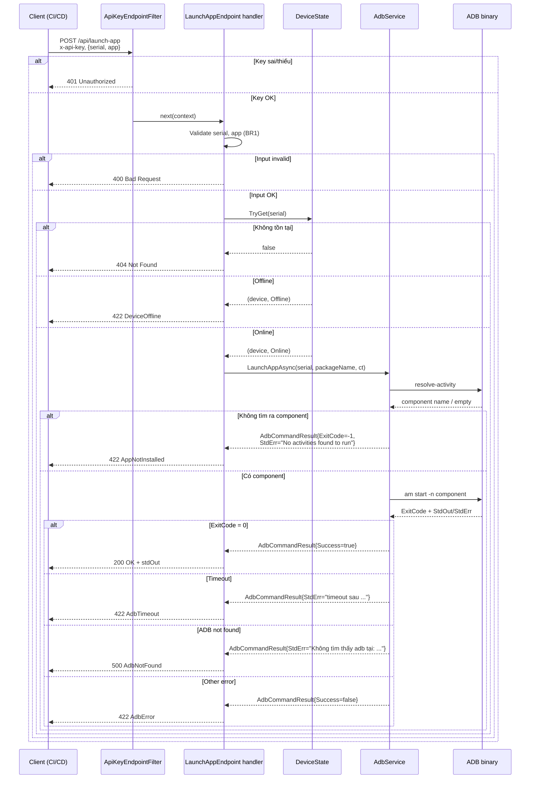

# TDD — API Launch App Android qua ADB

## Tham chiếu
- PRD: `docs/prd/PRD-adb-launch-app-api.md`
- User Story: `docs/user-stories/US-adb-launch-app-api.md` (SC-01..SC-08, BR1-BR6, EC1-EC7, Q1-Q5)
- Sprint plan: `docs/planning/SPRINT-adb-launch-app-api.md`
- Codebase liên quan:
  - `src/KztekAdbPublishTool.Web/Services/AdbService.cs` (`LaunchAppAsync`, `AdbCommandResult`)
  - `src/KztekAdbPublishTool.Web/State/DeviceState.cs` (`TryGet`)
  - `src/KztekAdbPublishTool.Web/Endpoints/InstallEndpoints.cs` (pattern tham khảo)
  - `src/KztekAdbPublishTool.Web/Configuration/AdbSettings.cs` (pattern config)
  - `src/KztekAdbPublishTool.Web/Program.cs` (nơi đăng ký DI + endpoint)

---

## ASSUMPTIONS I'M MAKING (đã chốt với user trước khi viết TDD)

1. API key `x-api-key` **CHỈ áp dụng riêng** cho endpoint launch-app mới — KHÔNG áp cho `/api/install` hay route cũ nào (SC-07, BR3). **User đã xác nhận cứng — không thảo luận lại.**
2. Project là ASP.NET Core Minimal API — dùng `IEndpointFilter` (idiomatic Minimal API) cho auth check, không phải `IMiddleware` toàn cục.
3. `AdbService.LaunchAppAsync(serial, packageName, ct)` đã có sẵn và đã đóng gói đúng `resolve-activity` + `am start -n` (KHÔNG dùng `monkey`) — chỉ tái sử dụng, không sửa signature.
4. Không cần multi-key, key rotation, audit log, rate limit trong phiên bản này (Non-goals PRD).
5. Config `LaunchApp:ApiKey` giữ trống mặc định trong `appsettings.json`; giá trị thật inject qua env var `LaunchApp__ApiKey` khi triển khai.

---

## Goals / Non-goals

**Goals:**
- 1 endpoint HTTP mới nhận `serial` + `app`, gọi `AdbService.LaunchAppAsync`, trả kết quả tường minh.
- Auth bằng API key tĩnh qua header `x-api-key`, phạm vi cứng ở endpoint mới.
- Config API key qua `appsettings.json`, override được bằng env var.
- Mapping HTTP status theo chính xác 8 scenario US: 200 / 400 / 401 / 404 / 422 / 500.

**Non-goals:**
- Không sửa route cũ, không sửa `AdbService`, không thêm UI.
- Không dùng global auth middleware (giữ backward-compat với `/api/install`).
- Không có DB migration, không có bảng mới.

---

## Kiến trúc đề xuất

```mermaid
flowchart TD
    C[Client HTTP<br/>POST /api/launch-app<br/>x-api-key: KEY<br/>body: {serial, app}] --> F[ApiKeyEndpointFilter<br/>đọc header x-api-key<br/>so với LaunchApp:ApiKey]
    F -- key sai/thiếu --> R401[401 Unauthorized<br/>KHÔNG gọi ADB]
    F -- key OK --> H[LaunchAppEndpoint handler]
    H --> V{Validate<br/>serial rỗng?<br/>package hợp lệ BR1?}
    V -- fail --> R400[400 Bad Request]
    V -- OK --> D{DeviceState.TryGet serial}
    D -- false --> R404[404 Not Found<br/>serial không tồn tại]
    D -- true, Offline --> R422a[422 Unprocessable<br/>device offline]
    D -- true, Online --> A[AdbService.LaunchAppAsync<br/>serial, packageName, ct]
    A --> RES{AdbCommandResult}
    RES -- ExitCode==0 --> R200[200 OK<br/>success + stdOut]
    RES -- ExitCode==-1<br/>StdErr=No activities... --> R422b[422 Unprocessable<br/>package chưa cài SC-06]
    RES -- ExitCode==-1<br/>StdErr chứa timeout --> R422c[422 Unprocessable<br/>ADB timeout EC1]
    RES -- ExitCode==-1<br/>StdErr=Không tìm thấy adb --> R500[500 Internal<br/>system error EC4]
    RES -- khác --> R422d[422 Unprocessable<br/>+ stdErr từ ADB]
```

---

## API Contract

### Route + HTTP verb

| Thuộc tính | Giá trị | Lý do |
|---|---|---|
| Method | `POST` | Action có side-effect (chạy `am start` trên thiết bị); REST convention cho command; body JSON gọn |
| Path | `/api/launch-app` | Nhất quán với `POST /api/install` hiện có (flat pattern), khớp PRD Scope; KHÔNG dùng `/api/devices/{serial}/launch-app` để tránh khác pattern với các route cũ |
| Content-Type | `application/json` | |

**Header bắt buộc:**
```
x-api-key: <giá-trị-cấu-hình-trong-LaunchApp:ApiKey>
Content-Type: application/json
```

**Request body:**
```json
{
  "serial": "192.168.1.100:5555",
  "app": "com.kztek.abc"
}
```

**DTO C# (`LaunchAppRequest`):**
```csharp
public sealed class LaunchAppRequest
{
    /// <summary>Serial ADB của thiết bị đích (VD: "192.168.1.100:5555" hoặc "R58N7XXXX").</summary>
    public string? Serial { get; set; }

    /// <summary>Package name Android hợp lệ (VD: "com.kztek.abc").</summary>
    public string? App { get; set; }
}
```

### Response schemas theo status code

**Q2 (quyết định):** Trả về `success`, `message`, `exitCode`, `stdOut`, `stdErr` để CI/CD tự debug được — ADB output không nhạy cảm (chỉ chứa tên package + component). Không leak API key hay path server.

**200 OK — SC-01, EC7 (bring-to-foreground)**
```json
{
  "success": true,
  "message": "App launched successfully.",
  "serial": "192.168.1.100:5555",
  "app": "com.kztek.abc",
  "exitCode": 0,
  "stdOut": "Starting: Intent { cmp=com.kztek.abc/.MainActivity }",
  "stdErr": ""
}
```

**400 Bad Request — SC-04, EC2, EC6**
```json
{
  "success": false,
  "error": "InvalidInput",
  "message": "Package name must contain at least one '.' and no whitespace (BR1)."
}
```
Các case triggering 400:
- `serial` null/empty/whitespace → message `"serial is required"`.
- `app` null/empty/whitespace → message `"app is required"`.
- `app` không có `.` hoặc chứa whitespace → message `"invalid package name"`.
- `app` không khớp regex Android package (xem `Validation` bên dưới) → message `"invalid package name"`.

**401 Unauthorized — SC-02**
```json
{
  "success": false,
  "error": "Unauthorized",
  "message": "Invalid or missing API key."
}
```

**404 Not Found — SC-03**
```json
{
  "success": false,
  "error": "DeviceNotFound",
  "message": "Device '192.168.1.100:5555' not found."
}
```

**422 Unprocessable Entity — SC-05, SC-06, EC1**
```json
{
  "success": false,
  "error": "DeviceOffline" | "AppNotInstalled" | "AdbTimeout" | "AdbError",
  "message": "Device '...' is offline." | "No activities found to run" | "adb ... timeout sau 10000ms" | "<StdErr từ ADB>",
  "exitCode": -1,
  "stdOut": "",
  "stdErr": "..."
}
```
Chi tiết mapping error code:
| Case US | `error` | Điều kiện phát hiện |
|---|---|---|
| SC-05 | `DeviceOffline` | `deviceState.TryGet(serial, out device)` == true và `device.Status != "Online"` |
| SC-06 | `AppNotInstalled` | `result.StdErr.Contains("No activities found to run")` |
| EC1 | `AdbTimeout` | `result.StdErr.Contains("timeout sau")` (khớp text từ `AdbService.RunAsync`) |
| Khác 422 | `AdbError` | `!result.Success` và không rơi vào 3 case trên và không phải EC4 |

**500 Internal Server Error — EC4 (system error, ADB binary thiếu)**
```json
{
  "success": false,
  "error": "AdbNotFound",
  "message": "adb binary not found on server."
}
```
Điều kiện: `result.StdErr.StartsWith("Không tìm thấy adb tại:")` — text định danh từ `AdbService.RunAsync`. Đây là lỗi hạ tầng (config sai hoặc container build lỗi), không phải lỗi input → trả 500, không phải 422.

---

## Auth Middleware / API Key

### Quyết định phạm vi (chốt cứng, không thảo luận lại)

**API key CHỈ áp cho endpoint `POST /api/launch-app`.** KHÔNG áp cho `/api/install`, `/api/devices`, `/api/scan`, `/api/health`, `/api/apk/*`, hay bất kỳ route cũ nào (SC-07, BR3). User đã xác nhận trực tiếp.

### Cơ chế: `IEndpointFilter` (không phải middleware toàn cục)

**Lý do chọn `IEndpointFilter` thay vì `IMiddleware`:**
1. Middleware toàn cục chạy cho MỌI request → vi phạm SC-07/BR3 (dù có logic bypass path prefix, vẫn tăng rủi ro regression).
2. `IEndpointFilter` là idiomatic Minimal API cho ASP.NET Core 7+, gắn cứng vào 1 endpoint qua `.AddEndpointFilter<T>()`.
3. Test được độc lập (mock `EndpointFilterInvocationContext`), phù hợp với architecture hiện tại (không có middleware pipeline riêng nào trong project).

### Tên config key và env var

**Section trong `appsettings.json`:** `LaunchApp`
**Property:** `ApiKey`
**Env var override:** `LaunchApp__ApiKey` (chuẩn ASP.NET Core với separator `__`).

`appsettings.json` (thêm section mới):
```json
{
  "LaunchApp": {
    "ApiKey": ""
  }
}
```

Docker Compose (thêm vào `docker-compose.yml` khi deploy):
```yaml
environment:
  - LaunchApp__ApiKey=<giá-trị-key-được-sinh-ngẫu-nhiên-≥32-ký-tự>
```

### POCO cấu hình

```csharp
namespace KztekAdbPublishTool.Web.Configuration;

public sealed class LaunchAppSettings
{
    public const string SectionName = "LaunchApp";

    /// <summary>
    /// API key tĩnh, PHẢI được đặt qua env var LaunchApp__ApiKey.
    /// Mặc định rỗng trong appsettings.json để tránh commit key vào git.
    /// Rỗng = endpoint tự chối 401 mọi request (fail-safe).
    /// </summary>
    public string ApiKey { get; set; } = string.Empty;
}
```

### Endpoint filter (`ApiKeyEndpointFilter`)

Pseudo-code (không phải bản implement — Senior Dev sẽ hoàn thiện):
```csharp
public sealed class ApiKeyEndpointFilter : IEndpointFilter
{
    private const string HeaderName = "x-api-key";
    private readonly LaunchAppSettings _settings;
    private readonly ILogger<ApiKeyEndpointFilter> _logger;

    public ApiKeyEndpointFilter(IOptions<LaunchAppSettings> options,
                                ILogger<ApiKeyEndpointFilter> logger)
    {
        _settings = options.Value;
        _logger = logger;
    }

    public async ValueTask<object?> InvokeAsync(
        EndpointFilterInvocationContext context,
        EndpointFilterDelegate next)
    {
        var expected = _settings.ApiKey;
        if (string.IsNullOrEmpty(expected))
        {
            // Fail-safe: config chưa đặt → mọi request bị chối
            _logger.LogWarning("LaunchApp:ApiKey chưa cấu hình — tất cả request bị 401.");
            return Results.Json(new {
                success = false, error = "Unauthorized",
                message = "Invalid or missing API key."
            }, statusCode: 401);
        }

        var provided = context.HttpContext.Request.Headers[HeaderName].ToString();

        // So sánh constant-time để chống timing attack (dùng CryptographicOperations.FixedTimeEquals)
        if (!FixedTimeEqualsUtf8(provided, expected))
        {
            return Results.Json(new {
                success = false, error = "Unauthorized",
                message = "Invalid or missing API key."
            }, statusCode: 401);
        }

        return await next(context);
    }

    // helper: so sánh 2 chuỗi ASCII/UTF-8 constant-time
    private static bool FixedTimeEqualsUtf8(string a, string b) { ... }
}
```

**Ghi chú bảo mật:**
- **Constant-time comparison** để chống timing attack. Dùng `CryptographicOperations.FixedTimeEquals(byte[], byte[])` (`System.Security.Cryptography`).
- **Fail-safe:** Nếu `ApiKey` rỗng (config chưa đặt env var) → chối 401 mọi request. KHÔNG cho phép mode "allow all" khi thiếu config.
- **Không log giá trị key** (dù đúng hay sai) — chỉ log info level cho các event bị chối, không kèm key.

### Đăng ký vào endpoint (KHÔNG global)

Trong `Program.cs`:
```csharp
// ── Configuration ─────────────────────────────────────────
builder.Services.Configure<LaunchAppSettings>(
    builder.Configuration.GetSection(LaunchAppSettings.SectionName));

// (không cần .AddScoped cho filter — dùng qua .AddEndpointFilter<T>() trực tiếp)

// ── Endpoints ────────────────────────────────────────────
app.MapLaunchAppEndpoints();  // filter gắn trong .MapPost().AddEndpointFilter<ApiKeyEndpointFilter>()
```

Trong `Endpoints/LaunchAppEndpoints.cs`:
```csharp
app.MapPost("/api/launch-app", handler)
   .AddEndpointFilter<ApiKeyEndpointFilter>();
```

**Kết quả:** Route cũ `/api/install`, `/api/devices`, ... KHÔNG chạy qua filter này — SC-07 tự động thoả.

---

## Vị trí đặt code

| File mới | Vai trò |
|---|---|
| `src/KztekAdbPublishTool.Web/Configuration/LaunchAppSettings.cs` | POCO cho config section `LaunchApp` |
| `src/KztekAdbPublishTool.Web/Endpoints/LaunchAppEndpoints.cs` | Static class `MapLaunchAppEndpoints`, chứa handler + DTO `LaunchAppRequest` (theo pattern `InstallEndpoints.cs`) |
| `src/KztekAdbPublishTool.Web/Endpoints/ApiKeyEndpointFilter.cs` | `IEndpointFilter` cho x-api-key (đặt cùng thư mục `Endpoints/` vì scope cứng cho 1 endpoint duy nhất; KHÔNG tạo thư mục `Middleware/` để tránh nhầm middleware toàn cục) |

**Lý do đổi tên file so với gợi ý ban đầu:**
- Gợi ý cũ: `LaunchAppEndpoint.cs` (số ít) → đổi thành `LaunchAppEndpoints.cs` (số nhiều) cho nhất quán với `InstallEndpoints.cs`, `DeviceEndpoints.cs`, ...
- Gợi ý cũ: `Middleware/ApiKeyMiddleware.cs` → đổi thành `Endpoints/ApiKeyEndpointFilter.cs` vì:
  1. Đây KHÔNG phải middleware toàn cục (đã giải thích ở §Auth).
  2. Đặt sát endpoint để reviewer thấy ngay filter thuộc endpoint nào.
  3. Không tạo thư mục `Middleware/` để tránh gợi ý sai về pattern global middleware.

**File sửa:**
| File | Thay đổi |
|---|---|
| `src/KztekAdbPublishTool.Web/Program.cs` | Thêm `builder.Services.Configure<LaunchAppSettings>(...)` và `app.MapLaunchAppEndpoints()` |
| `src/KztekAdbPublishTool.Web/appsettings.json` | Thêm section `"LaunchApp": { "ApiKey": "" }` |

**Docker Compose (deploy step):**
| File | Thay đổi |
|---|---|
| `docker-compose.yml` | Thêm env var `LaunchApp__ApiKey=<value>` — thao tác này ở STEP-4.3 DevOps Engineer, KHÔNG commit key thật vào git |

---

## Tái sử dụng `AdbService`

### Signature xác nhận (đọc từ `Services/AdbService.cs:171-188`)

```csharp
public async Task<AdbCommandResult> LaunchAppAsync(
    string serial,
    string packageName,
    CancellationToken ct = default)
```

- Return type: `AdbCommandResult` (`ExitCode`, `StdOut`, `StdErr`, `Success` = `ExitCode == 0`).
- Timeout internal: 10.000 ms cho cả `resolve-activity` và `am start`.
- **KHÔNG dùng `monkey`** — comment trong source (dòng 168-170) giải thích rõ do exit code không nhất quán giữa các ROM. Tech Lead xác nhận lại lần này: giữ nguyên, không đổi.

### Cách endpoint gọi

```csharp
// Trong handler
CancellationToken ct = httpContext.RequestAborted;
AdbCommandResult result = await adbService.LaunchAppAsync(serial, packageName, ct);
```

Không cần thêm timeout wrap ở tầng endpoint — `LaunchAppAsync` đã có `timeoutMs: 10000` cho từng bước ADB.

---

## Validation package name (BR1 + Q4)

**Q4 quyết định:** Dùng regex Android package naming chuẩn (chặt hơn BR1 tối thiểu). Lý do: kiểm tra sớm ở endpoint tránh gọi ADB vô ích khi package chắc chắn không hợp lệ; regex đủ ngắn để test dễ.

**Regex chuẩn Android package:**
```csharp
private static readonly Regex PackageNameRegex = new(
    @"^[a-zA-Z][a-zA-Z0-9_]*(\.[a-zA-Z][a-zA-Z0-9_]*)+$",
    RegexOptions.Compiled);
```

Ý nghĩa:
- Mỗi segment bắt đầu bằng chữ cái, chỉ chứa chữ/số/underscore.
- Phải có ≥ 2 segment ngăn cách bằng `.` (BR1 yêu cầu ≥ 1 dấu `.`).
- Không có whitespace, không có ký tự đặc biệt.

**Ví dụ:**
| Input | Kết quả |
|---|---|
| `com.kztek.abc` | Pass |
| `com.example` | Pass |
| `myapp` | Fail (không có `.`) |
| `com.kztek abc` | Fail (whitespace) |
| `1com.kztek.abc` | Fail (segment bắt đầu bằng số) |
| `com..kztek` | Fail (segment rỗng) |
| `   ` (chỉ whitespace) | Fail sau `Trim()` → empty |

**Thứ tự validate trong handler:**
1. Trim `serial` và `app` (EC2, EC6).
2. `serial` rỗng → 400 `"serial is required"`.
3. `app` rỗng → 400 `"app is required"`.
4. `app` không khớp regex → 400 `"invalid package name"`.

---

## Cách phân biệt SC-03 (404) và SC-05 (422)

Đây là quyết định cứng dựa trên `DeviceState.TryGet`:

```csharp
if (!deviceState.TryGet(serial, out var device) || device is null)
{
    // SC-03: serial CHƯA BAO GIỜ được thấy hoặc đã bị Remove
    return Results.NotFound(new {
        success = false, error = "DeviceNotFound",
        message = $"Device '{serial}' not found."
    });
}

if (!string.Equals(device.Status, "Online", StringComparison.Ordinal))
{
    // SC-05: serial đã biết nhưng offline (Status == "Offline" hoặc trạng thái khác)
    return Results.UnprocessableEntity(new {
        success = false, error = "DeviceOffline",
        message = $"Device '{serial}' is offline."
    });
}

// SC-01: Online → gọi ADB
```

**Nguồn dữ liệu:** `DeviceState` là in-memory snapshot (singleton, thread-safe qua `ConcurrentDictionary`), được `DevicePollWorker` cập nhật định kỳ. `DeviceRecord.Status` là string, giá trị `"Online"` hoặc `"Offline"`.

**Lưu ý so sánh case-sensitive `"Online"`:** DevicePollWorker/state gán chính xác chuỗi `"Online"`; dùng `StringComparison.Ordinal` khớp với convention codebase (`DeviceState` dùng `StringComparer.Ordinal`).

---

## Map lỗi ADB (SC-06 và các case 422/500)

Trong handler, sau khi có `AdbCommandResult result`:

```csharp
if (result.Success)  // ExitCode == 0
{
    return Results.Ok(new {
        success = true,
        message = "App launched successfully.",
        serial, app,
        exitCode = result.ExitCode,
        stdOut = result.StdOut,
        stdErr = result.StdErr
    });
}

// ExitCode != 0 → phân loại lỗi

// EC4 — system error (ADB binary không có)
if (result.StdErr.StartsWith("Không tìm thấy adb tại:", StringComparison.Ordinal))
{
    logger.LogError("ADB binary missing: {StdErr}", result.StdErr);
    return Results.Json(new {
        success = false, error = "AdbNotFound",
        message = "adb binary not found on server."
    }, statusCode: 500);
}

// SC-06 — package chưa cài
if (result.StdErr.Contains("No activities found to run", StringComparison.Ordinal))
{
    return Results.UnprocessableEntity(new {
        success = false, error = "AppNotInstalled",
        message = "No activities found to run",
        exitCode = result.ExitCode,
        stdOut = result.StdOut,
        stdErr = result.StdErr
    });
}

// EC1 — ADB timeout (device rớt mạng giữa chừng)
if (result.StdErr.Contains("timeout sau", StringComparison.Ordinal))
{
    return Results.UnprocessableEntity(new {
        success = false, error = "AdbTimeout",
        message = result.StdErr.Trim(),
        exitCode = result.ExitCode,
        stdOut = result.StdOut,
        stdErr = result.StdErr
    });
}

// Còn lại — lỗi ADB khác (tạm gộp về AdbError)
return Results.UnprocessableEntity(new {
    success = false, error = "AdbError",
    message = string.IsNullOrWhiteSpace(result.StdErr) ? "ADB command failed" : result.StdErr.Trim(),
    exitCode = result.ExitCode,
    stdOut = result.StdOut,
    stdErr = result.StdErr
});
```

**Text-matching source:**
- `"Không tìm thấy adb tại:"` — hardcoded trong `AdbService.RunAsync` khi `!File.Exists(_adbPath)` (dòng 46-51).
- `"No activities found to run"` — hardcoded trong `AdbService.LaunchAppAsync` khi `resolve-activity` không tìm ra component (dòng 182-185).
- `"timeout sau"` — hardcoded trong `AdbService.RunAsync` khi `OperationCanceledException` bắt được (dòng 87-92).

**Rủi ro coupling text:** Text tiếng Việt trong `AdbService` là interface không chính thức. Nếu tương lai đổi text → endpoint cần cập nhật đồng bộ. Ghi vào Code Review Checklist.

---

## Q5 — Hành vi khi app đã chạy sẵn (EC7)

**Quyết định:** KHÔNG thêm flag `-S` (force-stop trước) vào `am start`. Giữ nguyên `LaunchAppAsync` hiện tại (chỉ `am start -n <component>`).

**Lý do:**
- Behavior mặc định của `am start`: bring-to-foreground activity nếu app đã chạy — không mất state, không restart process. Đây là behavior mong muốn cho CI/CD post-deploy check.
- `-S` sẽ kill app trước rồi start lại — gây mất state, không cần thiết cho use case "confirm app khởi động được".
- ADB trả `ExitCode = 0` cả 2 trường hợp (cold start / bring-to-foreground) → endpoint trả 200 nhất quán.
- Nếu tương lai cần force-restart → thêm query flag riêng (VD: `?restart=true`) — ngoài scope phiên bản này.

---

## Error handling + Log level

| Case | HTTP | Log level | Nội dung log |
|---|---|---|---|
| Success (SC-01) | 200 | `Information` | `"Launch OK — serial={Serial}, app={App}, exitCode={ExitCode}"` |
| 401 (SC-02) | 401 | `Warning` | `"Unauthorized launch-app request — path={Path}, ip={RemoteIP}"` (KHÔNG log key) |
| 400 (SC-04, EC2, EC6) | 400 | `Information` | `"Invalid input — reason={Reason}"` |
| 404 (SC-03) | 404 | `Information` | `"Device not found — serial={Serial}"` |
| 422 DeviceOffline (SC-05) | 422 | `Information` | `"Device offline — serial={Serial}, status={Status}"` |
| 422 AppNotInstalled (SC-06) | 422 | `Information` | `"App not installed — serial={Serial}, app={App}"` |
| 422 AdbTimeout (EC1) | 422 | `Warning` | `"ADB timeout — serial={Serial}, app={App}, stdErr={StdErr}"` |
| 422 AdbError | 422 | `Warning` | `"ADB launch failed — serial={Serial}, app={App}, exitCode={ExitCode}, stdErr={StdErr}"` |
| 500 AdbNotFound (EC4) | 500 | `Error` | `"ADB binary missing — check AdbSettings.AdbPath"` |
| Unhandled exception | 500 | `Error` | `LogError(ex, "Unexpected error in launch-app")` — kèm stack trace |

**Structured logging:** Dùng `ILogger<LaunchAppEndpoint>` (inject qua handler) với placeholder `{Serial}`, `{App}` — KHÔNG string interpolation trực tiếp.

**Không log:**
- Giá trị `x-api-key` (dù đúng hay sai).
- Stack trace cho các case 400/401/404/422 (đây là input validation, không phải exception thực).

---

## Sequence diagram



---

## Rủi ro & cách giảm thiểu

| # | Rủi ro | Ảnh hưởng | Cách giảm |
|---|---|---|---|
| R1 | API key hardcode/commit vào git nếu dev điền vào `appsettings.json` | High (leak key) | `appsettings.json` giữ `ApiKey: ""` mặc định (fail-safe: rỗng = mọi request 401); giá trị thật CHỈ inject qua env var; DevOps ghi rõ trong DEPLOY doc |
| R2 | Timing attack tra key qua so sánh string thường | Medium | Dùng `CryptographicOperations.FixedTimeEquals` cho constant-time compare |
| R3 | Text-matching `StdErr` (tiếng Việt) coupling với `AdbService` — nếu đổi text sẽ vỡ mapping error | Low | Ghi vào Code Review Checklist; test unit đánh giá đủ 4 case StdErr; nếu cần refactor tương lai → tạo enum error type trong `AdbCommandResult` |
| R4 | Endpoint filter đăng ký sai (quên gắn `.AddEndpointFilter<>`) → route mới không auth | High (auth bypass) | Test integration SC-02 (thiếu header) PHẢI trả 401 — bắt được ngay nếu filter chưa gắn |
| R5 | Env var `LaunchApp__ApiKey` chưa set trong container → `ApiKey` rỗng → mọi request 401 | Medium (endpoint chết) | Fail-safe design cố ý — DevOps checklist yêu cầu verify env var trước deploy; log warning cảnh báo config trống |
| R6 | Timeout ADB (10s) không cover được trường hợp thiết bị hang → response có thể chậm | Low | Chấp nhận — timeout 10s là hằng số nội tại của `AdbService`, không thay đổi trong phiên bản này |
| R7 | Response leak `stdOut`/`stdErr` chứa thông tin nội bộ | Low | Đánh giá: ADB output chỉ chứa tên component + serial (đã biết ở client) — không nhạy cảm; giữ nguyên để dễ debug |

---

## Task breakdown

| ID | Tên task | Owner | Estimate | Phụ thuộc |
|----|----------|-------|----------|-----------|
| T-3.1a | Tạo `LaunchAppSettings.cs` + section `LaunchApp` trong `appsettings.json` | Senior Developer | 0.5h | - |
| T-3.1b | Tạo `ApiKeyEndpointFilter.cs` (constant-time compare, fail-safe rỗng) | Senior Developer | 1h | T-3.1a |
| T-3.1c | Tạo `LaunchAppEndpoints.cs` + DTO `LaunchAppRequest` + handler đầy đủ mapping | Senior Developer | 2h | T-3.1a, T-3.1b |
| T-3.1d | Đăng ký DI + `MapLaunchAppEndpoints()` trong `Program.cs` | Senior Developer | 0.25h | T-3.1c |
| T-3.1e | Unit test filter (401 các case) + endpoint (200/400/404/422/500 mapping) | Senior Developer | 2h | T-3.1c |
| T-3.1f | Chạy `graphify update --diff` (nếu có), cập nhật `code-graph/CODE-GRAPH.md`, chạy `/verify-pr` | Senior Developer | 0.5h | T-3.1e |
| T-3.2 | Tech Lead review + `security-audit-stride` (bắt buộc — đụng auth) | Tech Lead | 1h | T-3.1f |
| T-4.1 | Test plan + test case + smoke test manual | QA Engineer | 2h | T-3.2 merge |
| T-4.2 | QA Lead sign-off (P1) | QA Lead | 0.5h | T-4.1 |
| T-4.3 | DevOps deploy — thêm env var `LaunchApp__ApiKey` vào `docker-compose.yml`, verify không commit key | DevOps Engineer | 0.5h | T-4.2 |
| T-4.4 | DevOps Lead approve + smoke test production | DevOps Lead | 0.5h | T-4.3 |

Total estimate Phase 3+4: ~10h — khớp Sprint plan v1.0 của Project Manager.

---

## Code Review Checklist (Tech Lead dùng cho STEP-3.2)

- [ ] Endpoint route đúng `POST /api/launch-app` (không phải `GET`, không nested `/api/devices/{serial}/launch-app`).
- [ ] `ApiKeyEndpointFilter` chỉ gắn cứng vào endpoint launch-app qua `.AddEndpointFilter<>()` — KHÔNG dùng `app.Use()` toàn cục.
- [ ] Route cũ `/api/install`, `/api/devices`, `/api/scan`, `/api/health`, `/api/apk/*` KHÔNG bị áp filter (verify bằng test integration hoặc curl không header).
- [ ] So sánh API key dùng `CryptographicOperations.FixedTimeEquals` (constant-time), KHÔNG dùng `==` hoặc `string.Equals`.
- [ ] Fail-safe: `ApiKey` rỗng → 401, KHÔNG cho phép bypass.
- [ ] Không log giá trị `x-api-key` ở bất kỳ log level nào.
- [ ] Validation package name khớp regex `^[a-zA-Z][a-zA-Z0-9_]*(\.[a-zA-Z][a-zA-Z0-9_]*)+$`.
- [ ] Phân biệt SC-03 (404) và SC-05 (422) đúng — TryGet false vs Status != "Online".
- [ ] Mapping StdErr → HTTP status đủ 4 case: `"Không tìm thấy adb tại:"` (500), `"No activities found to run"` (422 AppNotInstalled), `"timeout sau"` (422 AdbTimeout), else (422 AdbError).
- [ ] Handler dùng `HttpContext.RequestAborted` làm `CancellationToken` truyền vào `LaunchAppAsync`.
- [ ] KHÔNG sửa `AdbService.cs` — chỉ tái sử dụng `LaunchAppAsync` hiện có.
- [ ] Structured logging với placeholder `{Serial}`, `{App}` (không interpolation).
- [ ] `security-audit-stride` PASS trước khi merge (STRIDE: Spoofing/Tampering/Repudiation/Info Disclosure/DoS/EoP cho endpoint auth).
- [ ] `code-graph/CODE-GRAPH.md` cập nhật mục "API endpoints" (thêm `/api/launch-app`) và "Dependencies" (thêm `LaunchAppSettings`, `ApiKeyEndpointFilter`).
- [ ] Docker Compose env var `LaunchApp__ApiKey` được document trong DEPLOY doc (STEP-4.3), KHÔNG commit giá trị thật vào git.

---

## Non-goals lặp lại (nhấn mạnh cho reviewer)

- KHÔNG áp API key cho `/api/install` hay route cũ khác — quyết định cứng đã chốt với user.
- KHÔNG dùng global `IMiddleware` — phải là `IEndpointFilter` scope 1 endpoint.
- KHÔNG sửa `AdbService.LaunchAppAsync`.
- KHÔNG dùng `monkey`.
- KHÔNG có UI mới, không có DB migration, không có bảng mới.

---

*Tài liệu do Tech Lead viết ngày 2026-08-18. Được duyệt để chuyển Senior Developer thực thi STEP-3.1.*
