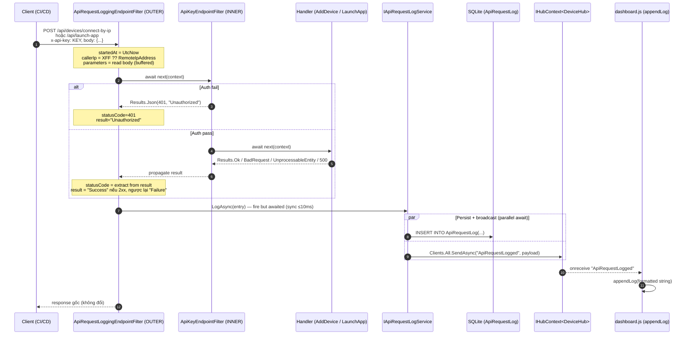
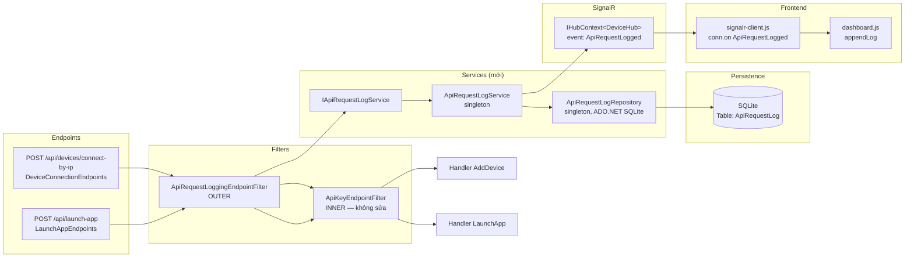

# TDD — API Request Log

## Tham chiếu
- PRD: `docs/prd/PRD-api-request-log.md`
- User Stories: `docs/user-stories/US-api-request-log.md` (US-001..US-006, BR-G1..BR-G10)
- Sprint plan: `docs/planning/SPRINT-api-request-log.md`
- Codebase liên quan:
  - `src/KztekAdbPublishTool.Web/Endpoints/DeviceConnectionEndpoints.cs` (AddDevice API)
  - `src/KztekAdbPublishTool.Web/Endpoints/LaunchAppEndpoints.cs` (LaunchApp API)
  - `src/KztekAdbPublishTool.Web/Endpoints/ApiKeyEndpointFilter.cs` (auth filter — KHÔNG sửa)
  - `src/KztekAdbPublishTool.Web/Services/DeviceRepository.cs` (pattern SQLite ADO.NET tham khảo)
  - `src/KztekAdbPublishTool.Web/Hubs/DeviceHub.cs` (SignalR hub tái dùng)
  - `src/KztekAdbPublishTool.Web/wwwroot/js/signalr-client.js`, `dashboard.js` (`appendLog()`)
  - `src/KztekAdbPublishTool.Web/Program.cs` (nơi đăng ký DI + endpoint filter)

---

## ASSUMPTIONS I'M MAKING (đã chốt trước khi viết TDD — không thảo luận lại)

1. Project **KHÔNG dùng EF Core** cho persistence — hiện tại `DeviceRepository` dùng `Microsoft.Data.Sqlite` ADO.NET + raw SQL + `CREATE TABLE IF NOT EXISTS` ở constructor. TDD này giữ nguyên pattern đó thay vì thêm EF Migration mới (dù PLAN-MASTER artifact list có ghi "EF Migration"). **Table `ApiRequestLog` được tạo idempotent tại startup qua `ApiRequestLogRepository.Initialize()`**. Nếu sau này project muốn migrate sang EF, chuyển đổi tất cả 3 table cùng lúc — không lệch pattern.
2. Project là ASP.NET Core Minimal API — dùng `IEndpointFilter` cho cả logging và auth (idiomatic pattern đã thiết lập ở `ApiKeyEndpointFilter`, `LaunchAppEndpoints`, `DeviceConnectionEndpoints`).
3. `ApiKeyEndpointFilter` **BẤT KHẢ XÂM PHẠM** (PRD Non-goals + BR-G10). Logging 401 giải quyết bằng **filter riêng đặt bên NGOÀI** filter auth (chain-of-responsibility).
4. Không có reverse proxy phía trước app trong deploy hiện tại (Docker LAN direct) → `HttpContext.Connection.RemoteIpAddress` đủ dùng làm nguồn chính. Vẫn đọc `X-Forwarded-For` first-hop nếu header có mặt (defensive) — không cấu hình `ForwardedHeadersOptions` toàn cục ở phiên bản này.
5. SignalR broadcast là **best-effort** — broadcast fail (ví dụ no client) KHÔNG được ảnh hưởng persistence (US-001 EC1/EC2).
6. Không có retention/purge trong phiên bản này — Non-goal PRD; SQLite file phình tuyến tính với số request; chấp nhận cho P2.

---

## Goals / Non-goals

**Goals:**
- Bảng SQLite mới `ApiRequestLog` idempotent, bền vững qua restart.
- Service duy nhất `IApiRequestLogService.LogAsync(...)` — dùng lại cho cả 2 API + filter 401.
- Endpoint filter mới `ApiRequestLoggingEndpointFilter` đặt **outer** so với `ApiKeyEndpointFilter` — bắt được cả 401 mà KHÔNG sửa filter auth.
- SignalR broadcast event structured `"ApiRequestLogged"` để JS render trong panel `#log` qua `appendLog()`.
- Response caller **không thay đổi** so với trước (BR-G3): status code, body, headers giữ nguyên; latency thêm ≤ 20ms.

**Non-goals:**
- KHÔNG log các API khác (`/api/install`, `/api/devices/connect`, `/api/apk/upload`, ...) — chỉ 2 API mới trong scope.
- KHÔNG sửa `ApiKeyEndpointFilter`.
- KHÔNG tạo trang UI mới; tái dùng panel `#log` + hàm `appendLog()`.
- KHÔNG retention/export/search log trong phiên bản này.
- KHÔNG rate limit dựa trên log.

---

## Kiến trúc đề xuất

### Sequence diagram — dòng chảy request → log → broadcast → render



### Component diagram



**Vì sao `ApiRequestLoggingEndpointFilter` phải OUTER (đăng ký TRƯỚC `ApiKeyEndpointFilter`)?**
Trong ASP.NET Core Minimal API, các `IEndpointFilter` chạy theo thứ tự đăng ký: filter đăng ký TRƯỚC là filter OUTERMOST, gọi `await next(context)` sẽ chạy filter tiếp theo trong chain rồi mới đến handler. Muốn bắt được 401 do `ApiKeyEndpointFilter` short-circuit trả về, filter logging PHẢI đặt outer để nhìn thấy final `object?` trả về (kể cả khi handler chưa được gọi).

---

## SQL Schema — bảng `ApiRequestLog`

### DDL (chạy idempotent tại constructor `ApiRequestLogRepository`)

```sql
CREATE TABLE IF NOT EXISTS ApiRequestLog (
    Id             INTEGER PRIMARY KEY AUTOINCREMENT,
    Timestamp      TEXT    NOT NULL,               -- ISO-8601 UTC roundtrip ("o"), phù hợp với pattern DeviceRepository
    ApiName        TEXT    NOT NULL,               -- "AddDevice" | "LaunchApp" (enum-string, không dùng int để dễ query)
    HttpMethod     TEXT    NOT NULL,               -- "POST" hiện tại; để mở rộng sau
    Path           TEXT    NOT NULL,               -- "/api/devices/connect-by-ip" | "/api/launch-app"
    Parameters     TEXT    NULL,                   -- JSON string hoặc "invalid body" — có thể null khi 401 chưa parse được body
    Result         TEXT    NOT NULL,               -- "Success" | "Failure" | "Unauthorized"
    HttpStatusCode INTEGER NOT NULL,               -- 200 / 400 / 401 / 404 / 422 / 500
    ErrorMessage   TEXT    NULL,                   -- ngắn gọn (≤ 500 ký tự), null nếu Success
    CallerIp       TEXT    NOT NULL,               -- "unknown" nếu không xác định được
    DurationMs     INTEGER NOT NULL                -- thời gian xử lý end-to-end (≥ 0)
);

-- Index phục vụ query lịch sử theo thời gian (query DESC + LIMIT — không dùng ORM):
CREATE INDEX IF NOT EXISTS IX_ApiRequestLog_Timestamp
    ON ApiRequestLog(Timestamp DESC);
```

### Ràng buộc & lưu ý

- **PRIMARY KEY AUTOINCREMENT** — an toàn trong ghi concurrent (SQLite lock write ở mức DB); không có bản ghi trùng.
- **Column length**: SQLite không enforce độ dài TEXT, nhưng service PHẢI truncate ở tầng .NET:
  - `Parameters`: max 1024 ký tự (đủ chứa `{"ip":"...","port":...}` hoặc `{"serial":"...","app":"..."}`).
  - `ErrorMessage`: max 500 ký tự.
  - `Path`: không truncate (route cứng ngắn).
- **DurationMs = 0** cho trường hợp 401 khi cần đo trước khi vào chain — vẫn ghi timestamp bắt đầu là khi filter được gọi.
- **Không add FK sang Devices.Serial** — LaunchApp có thể log với serial chưa hề tồn tại; giữ độc lập.

### Persist qua restart (US-005)

- SQLite file dùng cùng `DbPath` với `DeviceRepository` (`AdbSettings.DbPath`) — đã được mount volume trong `docker-compose.yml`. Không cần thay đổi volume mapping.
- `ApiRequestLogRepository.Initialize()` chạy `CREATE TABLE IF NOT EXISTS` → idempotent, không phá dữ liệu cũ (US-005 SC3).

---

## Service Interface — `IApiRequestLogService`

### File mới: `src/KztekAdbPublishTool.Web/Services/IApiRequestLogService.cs`

```csharp
namespace KztekAdbPublishTool.Web.Services;

/// <summary>
/// Ghi lịch sử request cho 2 API có ApiKey protection (AddDevice, LaunchApp).
/// Async fire-and-await (caller await trước khi trả response) — SQLite insert < 10ms.
/// Failure isolation: mọi exception phải được swallow + log qua ILogger, KHÔNG throw ra caller (BR-G9).
/// </summary>
public interface IApiRequestLogService
{
    /// <summary>
    /// Ghi 1 bản ghi log + broadcast SignalR event "ApiRequestLogged" tới mọi client.
    /// </summary>
    /// <param name="entry">Bản ghi log đã được filter chuẩn bị đầy đủ.</param>
    /// <param name="ct">CancellationToken của HttpContext.RequestAborted (best-effort — nếu ct hủy giữa chừng, không throw ra caller).</param>
    Task LogAsync(ApiRequestLogEntry entry, CancellationToken ct);
}
```

### DTO — `ApiRequestLogEntry` (POCO)

File mới: `src/KztekAdbPublishTool.Web/Models/ApiRequestLogEntry.cs`

```csharp
namespace KztekAdbPublishTool.Web.Models;

/// <summary>
/// Bản ghi log 1 API request — cả DB row + SignalR payload (mirror pattern DeviceRecord).
/// Property đặt PascalCase; SignalR serializer sẽ tự chuyển camelCase khi lên JS (System.Text.Json default).
/// </summary>
public sealed class ApiRequestLogEntry
{
    public long Id { get; set; }                          // 0 khi chưa insert; DB tự set sau INSERT
    public DateTime Timestamp { get; set; }               // UTC
    public string ApiName { get; set; } = string.Empty;   // "AddDevice" | "LaunchApp"
    public string HttpMethod { get; set; } = "POST";
    public string Path { get; set; } = string.Empty;
    public string? Parameters { get; set; }               // JSON string, có thể null
    public string Result { get; set; } = string.Empty;    // "Success" | "Failure" | "Unauthorized"
    public int HttpStatusCode { get; set; }
    public string? ErrorMessage { get; set; }
    public string CallerIp { get; set; } = "unknown";
    public int DurationMs { get; set; }
}
```

### Constants — tránh magic string

File mới: `src/KztekAdbPublishTool.Web/Services/ApiRequestLogConstants.cs`

```csharp
namespace KztekAdbPublishTool.Web.Services;

public static class ApiRequestLogConstants
{
    // ApiName enum-string (đúng chính tả — dùng ở endpoint filter, JS handler, test)
    public const string ApiAddDevice = "AddDevice";
    public const string ApiLaunchApp = "LaunchApp";

    // Result enum-string
    public const string ResultSuccess      = "Success";
    public const string ResultFailure      = "Failure";
    public const string ResultUnauthorized = "Unauthorized";

    // SignalR event name — cố định, JS handler đăng ký chuỗi này
    public const string SignalREvent = "ApiRequestLogged";

    // Length caps (truncate ở tầng service trước khi ghi/broadcast)
    public const int MaxParametersLength   = 1024;
    public const int MaxErrorMessageLength = 500;
}
```

### Repository — `ApiRequestLogRepository`

File mới: `src/KztekAdbPublishTool.Web/Services/ApiRequestLogRepository.cs`. Pattern mirror `DeviceRepository` (raw ADO.NET).

**Signature bắt buộc:**
```csharp
public sealed class ApiRequestLogRepository
{
    public ApiRequestLogRepository(IOptions<AdbSettings> options);   // đọc AdbSettings.DbPath, Initialize()
    public async Task<long> InsertAsync(ApiRequestLogEntry entry, CancellationToken ct);   // trả Id vừa gán
}
```

Chi tiết:
- Constructor mirror `DeviceRepository`: `Directory.CreateDirectory(dir)` + `_connectionString = "Data Source={dbPath}"` + `Initialize()` chạy DDL trên.
- `InsertAsync` dùng `await using SqliteConnection` + `await conn.OpenAsync(ct)` + `cmd.Parameters.AddWithValue(...)` + `cmd.ExecuteScalar` với `RETURNING Id` (SQLite ≥ 3.35 hỗ trợ; nếu không dùng được, fallback `SELECT last_insert_rowid()`).
- **KHÔNG throw** — catch exception, log qua `ILogger<ApiRequestLogRepository>` với level Error, trả về `-1` (caller `ApiRequestLogService` sẽ ignore return này). Isolation này thực hiện ở `ApiRequestLogService` để repository giữ trách nhiệm đơn (SRP).

### Implementation — `ApiRequestLogService`

File mới: `src/KztekAdbPublishTool.Web/Services/ApiRequestLogService.cs`.

**Hành vi bắt buộc:**
1. Truncate `entry.Parameters` và `entry.ErrorMessage` theo `MaxParametersLength` / `MaxErrorMessageLength` TRƯỚC khi ghi.
2. `try { await _repo.InsertAsync(entry, ct); } catch (Exception ex) { _logger.LogError(ex, "..."); }` — swallow (BR-G9).
3. `try { await _hub.Clients.All.SendAsync(ApiRequestLogConstants.SignalREvent, entry, ct); } catch (Exception ex) { _logger.LogWarning(ex, "..."); }` — swallow (best-effort).
4. **Không dùng `Task.Run` fire-and-forget** — trả về `Task` để caller filter có thể await; tổng cost < 20ms, chấp nhận trên hot path (AC1/AC2 latency ≤ 1s dư dả).

---

## Endpoint Changes

### File mới: `src/KztekAdbPublishTool.Web/Endpoints/ApiRequestLoggingEndpointFilter.cs`

**Trách nhiệm:** capture request context → gọi `next()` → capture result → xây `ApiRequestLogEntry` → gọi `IApiRequestLogService.LogAsync` → trả result gốc (không đổi).

**Signature bắt buộc:**
```csharp
public sealed class ApiRequestLoggingEndpointFilter : IEndpointFilter
{
    private readonly IApiRequestLogService _logService;
    private readonly ILogger<ApiRequestLoggingEndpointFilter> _logger;

    public ApiRequestLoggingEndpointFilter(
        IApiRequestLogService logService,
        ILogger<ApiRequestLoggingEndpointFilter> logger)
    { _logService = logService; _logger = logger; }

    public async ValueTask<object?> InvokeAsync(
        EndpointFilterInvocationContext context,
        EndpointFilterDelegate next)
    {
        var http = context.HttpContext;
        var sw = System.Diagnostics.Stopwatch.StartNew();
        var startedAt = DateTime.UtcNow;

        // Xác định ApiName theo route (path đầu request, không lệ thuộc method args)
        var path = http.Request.Path.Value ?? string.Empty;
        var apiName = ResolveApiName(path);   // "AddDevice" | "LaunchApp"

        // [UPDATE 2026-08-19 — Fix UI-001] KHÔNG đọc raw body stream.
        //   Lý do: trong Minimal API, model binding (ReadFromJsonAsync) chạy TRƯỚC filter chain,
        //   nên khi filter được gọi http.Request.Body đã bị consumed → stream ở EOF → luôn trả empty.
        //   Thay vào đó: serialize context.Arguments[0] — bound request object mà framework đã chuẩn bị
        //   trước filter chain. Vẫn bắt được cả 401 vì filter này đăng ký OUTER (trước ApiKeyEndpointFilter),
        //   và Minimal API bind arguments trước bất kỳ filter nào chạy.
        string? parametersJson = TryExtractParametersJson(context);

        var callerIp = ResolveCallerIp(http);

        object? result;
        int statusCode;
        string? errorMessage = null;
        string outcome;

        try
        {
            result = await next(context);
            statusCode = ExtractStatusCode(result, http);   // xem helper dưới
            outcome = statusCode switch
            {
                401         => ApiRequestLogConstants.ResultUnauthorized,
                >= 200 and < 300 => ApiRequestLogConstants.ResultSuccess,
                _           => ApiRequestLogConstants.ResultFailure
            };
            // Không moi body response — chỉ ghi errorMessage khi phát hiện dễ (ví dụ result là IValueHttpResult<T> có error property) — best-effort, có thể null.
            errorMessage = ExtractErrorMessage(result);
        }
        catch (Exception ex)
        {
            // Handler throw unhandled — chain sẽ trả 500 sau. Log là "Failure" + 500.
            statusCode = 500;
            outcome = ApiRequestLogConstants.ResultFailure;
            errorMessage = Truncate(ex.Message, ApiRequestLogConstants.MaxErrorMessageLength);
            result = null;
            _logger.LogError(ex, "Unhandled exception in logged endpoint: {Path}", path);
            throw;   // để pipeline 500-handler làm việc; log entry vẫn ghi ở finally
        }
        finally
        {
            sw.Stop();
            var entry = new ApiRequestLogEntry
            {
                Timestamp      = startedAt,
                ApiName        = apiName,
                HttpMethod     = http.Request.Method,
                Path           = path,
                Parameters     = Truncate(parametersJson, ApiRequestLogConstants.MaxParametersLength),
                Result         = outcome,
                HttpStatusCode = statusCode,
                ErrorMessage   = errorMessage,
                CallerIp       = callerIp,
                DurationMs     = (int)sw.ElapsedMilliseconds
            };
            // fire-and-forget lightweight: không await để không block response nếu SignalR chậm.
            // NHƯNG SVC đã swallow exception → an toàn để await nhanh. Chọn await để đảm bảo latency ≤ 1s AC1/AC2.
            await _logService.LogAsync(entry, http.RequestAborted);
        }

        return result;
    }

    // — Helpers (private static) —
    private static string ResolveApiName(string path)
    {
        if (path.Equals("/api/devices/connect-by-ip", StringComparison.OrdinalIgnoreCase))
            return ApiRequestLogConstants.ApiAddDevice;
        if (path.Equals("/api/launch-app", StringComparison.OrdinalIgnoreCase))
            return ApiRequestLogConstants.ApiLaunchApp;
        return "Unknown";   // guard — trong thực tế filter chỉ gắn vào 2 route trên
    }

    private static string ResolveCallerIp(HttpContext http)
    {
        // XFF first-hop nếu có (defensive — hiện chưa có reverse proxy)
        var xff = http.Request.Headers["X-Forwarded-For"].ToString();
        if (!string.IsNullOrWhiteSpace(xff))
        {
            var first = xff.Split(',')[0].Trim();
            if (!string.IsNullOrEmpty(first)) return first;
        }
        return http.Connection.RemoteIpAddress?.ToString() ?? "unknown";
    }

    // [UPDATE 2026-08-19 — Fix UI-001] Bỏ TryReadBodyJsonAsync, thay bằng TryExtractParametersJson.
    // Options dùng chung — tránh allocate mới mỗi request.
    private static readonly System.Text.Json.JsonSerializerOptions CamelCaseOptions = new()
    {
        PropertyNamingPolicy = System.Text.Json.JsonNamingPolicy.CamelCase
    };

    // Trích xuất tham số request bằng cách serialize argument đã được model-bound.
    // Bỏ qua các framework/system type (HttpContext, CancellationToken, DI services) — chỉ log request DTO.
    // Nếu framework model-binding fail (VD: body malformed JSON) → request bị reject 400 TRƯỚC khi filter chạy
    // → không cần xử lý "invalid body" ở đây (khác bản trước đọc raw stream).
    private static string? TryExtractParametersJson(EndpointFilterInvocationContext context)
    {
        try
        {
            if (context.Arguments.Count == 0) return null;
            var firstArg = context.Arguments[0];
            if (firstArg is null) return null;

            var t = firstArg.GetType();
            if (firstArg is HttpContext or CancellationToken) return null;
            if (t.Namespace?.StartsWith("Microsoft", StringComparison.Ordinal) == true) return null;
            if (t.Namespace?.StartsWith("System",    StringComparison.Ordinal) == true) return null;

            return System.Text.Json.JsonSerializer.Serialize(firstArg, t, CamelCaseOptions);
        }
        catch { return null; }
    }

    private static int ExtractStatusCode(object? result, HttpContext http)
    {
        // Results.Ok/BadRequest/NotFound/... đều implement IStatusCodeHttpResult
        if (result is Microsoft.AspNetCore.Http.IStatusCodeHttpResult sc && sc.StatusCode.HasValue)
            return sc.StatusCode.Value;
        // Fallback: xem http.Response.StatusCode (đã set nếu handler ghi thẳng)
        return http.Response.StatusCode == 0 ? 200 : http.Response.StatusCode;
    }

    private static string? ExtractErrorMessage(object? result)
    {
        // Nỗ lực best-effort — mọi endpoint hiện tại trả anonymous object {success, error, message};
        // để đơn giản, không moi property qua reflection ở phiên bản này → luôn null trừ trường hợp catch throw.
        return null;
    }

    private static string? Truncate(string? s, int max)
        => (s is null || s.Length <= max) ? s : s.Substring(0, max);
}
```

### Sửa `DeviceConnectionEndpoints.cs`

Chỉ thêm 1 filter ở CẢ 2 endpoint (`POST /api/devices/connect-by-ip` và `GET /api/devices/{serial}/status`). **Ghi chú quan trọng**: theo scope PRD/US chỉ log `POST /api/devices/connect-by-ip` — KHÔNG gắn filter cho `GET /api/devices/{serial}/status`.

```csharp
// TRƯỚC (hiện tại):
app.MapPost("/api/devices/connect-by-ip", async (...) => { ... })
    .AddEndpointFilter<ApiKeyEndpointFilter>();

// SAU:
app.MapPost("/api/devices/connect-by-ip", async (...) => { ... })
    .AddEndpointFilter<ApiRequestLoggingEndpointFilter>()   // ← MỚI, PHẢI đăng ký TRƯỚC (OUTER)
    .AddEndpointFilter<ApiKeyEndpointFilter>();             // ← không sửa
```

**Không đụng** endpoint `GET /api/devices/{serial}/status` — Non-goal PRD.

### Sửa `LaunchAppEndpoints.cs`

```csharp
app.MapPost("/api/launch-app", async (...) => { ... })
    .AddEndpointFilter<ApiRequestLoggingEndpointFilter>()   // ← MỚI, TRƯỚC
    .AddEndpointFilter<ApiKeyEndpointFilter>();             // ← không sửa
```

### Sửa `Program.cs` — DI registration

Thêm ngay sau block `// ── Services ──`:

```csharp
// ── API Request Log (feature api-request-log) ────────────────────────────────
builder.Services.AddSingleton<ApiRequestLogRepository>();
builder.Services.AddSingleton<IApiRequestLogService, ApiRequestLogService>();
builder.Services.AddScoped<ApiRequestLoggingEndpointFilter>();   // filter là scoped theo pattern ApiKeyEndpointFilter
```

*Lưu ý:* `ApiKeyEndpointFilter` hiện tại đăng ký implicit qua DI (filter được resolve từ container). Áp dụng cùng lifetime scope (Scoped) cho `ApiRequestLoggingEndpointFilter` để nhất quán.

---

## SignalR Event Contract

### Tên event
`ApiRequestLogged` (giá trị `ApiRequestLogConstants.SignalREvent`).

### Payload — 1 argument duy nhất (object)

Server gọi:
```csharp
await _hub.Clients.All.SendAsync(
    ApiRequestLogConstants.SignalREvent,
    entry,   // ApiRequestLogEntry — serialize thành camelCase JSON
    ct);
```

**Schema JSON gửi tới client (camelCase — System.Text.Json default):**
```json
{
  "id": 42,
  "timestamp": "2026-08-19T13:34:56.789Z",
  "apiName": "AddDevice",
  "httpMethod": "POST",
  "path": "/api/devices/connect-by-ip",
  "parameters": "{\"ip\":\"192.168.1.10\",\"port\":5555}",
  "result": "Success",
  "httpStatusCode": 200,
  "errorMessage": null,
  "callerIp": "10.0.0.15",
  "durationMs": 47
}
```

### Method trên Hub
**KHÔNG thêm method mới trên `DeviceHub`** — dùng `IHubContext<DeviceHub>.Clients.All.SendAsync(...)` như pattern `InstallCoordinator`/`ScanCoordinator`. Không cần thêm method server-side để client gọi (client chỉ nhận event).

### Group / broadcast scope
Broadcast tới `Clients.All` — mọi dashboard đang mở đều nhận (US-006 Scenario 2). Không dùng group riêng ở phiên bản này.

### Reliability
Best-effort. SignalR không retry, không replay khi client mất kết nối tạm thời (US-006 Scenario 4). Log entry vẫn được lưu SQLite bất kể broadcast fail.

---

## JS Handler Contract

### File cần sửa: `src/KztekAdbPublishTool.Web/wwwroot/js/dashboard.js`

Trong hàm `setupSignalR()` — thêm handler mới ngay sau các handler hiện có (`DevicesUpdated`, `Log`, `InstallProgress`, `DeviceInstalled`):

```javascript
// Server → client: API request log (feature api-request-log)
conn.on('ApiRequestLogged', function (entry) {
    appendLog(formatApiRequestLog(entry));
});
```

### Helper hàm mới trong `dashboard.js` (đặt gần `appendLog`)

```javascript
// ── API request log format (US-006 BR3) ─────────────────────────────────
// Format: "[API] apiName param → result (HTTP status, durationMs) caller"
// Ví dụ:  "[API] AddDevice ip=192.168.1.10:5555 → Success (200, 47ms) from 10.0.0.15"
//         "[API] LaunchApp serial=ABC123, app=com.kztek.demo → Unauthorized (401, 3ms) from 10.0.0.9"
function formatApiRequestLog(entry) {
    if (!entry) return '[API] (empty log entry)';
    var paramStr = summarizeParams(entry.apiName, entry.parameters);
    var status = entry.httpStatusCode || '-';
    var dur = (entry.durationMs != null ? entry.durationMs : 0) + 'ms';
    var caller = entry.callerIp ? ('from ' + entry.callerIp) : '';
    return '[API] ' + (entry.apiName || 'Unknown') + ' '
         + paramStr + ' → ' + (entry.result || '-')
         + ' (' + status + ', ' + dur + ') ' + caller;
}

// Tóm tắt parameters JSON thành text ngắn. Best-effort — nếu parse fail hoặc "invalid body" → hiển thị nguyên.
function summarizeParams(apiName, paramsJsonOrNull) {
    if (!paramsJsonOrNull) return '(no body)';
    if (paramsJsonOrNull === 'invalid body') return '(invalid body)';
    try {
        var p = JSON.parse(paramsJsonOrNull);
        if (apiName === 'AddDevice') {
            var ip = p.ip || p.Ip || '?';
            var port = (p.port != null ? p.port : (p.Port != null ? p.Port : 5555));
            return 'ip=' + ip + ':' + port;
        }
        if (apiName === 'LaunchApp') {
            var serial = p.serial || p.Serial || '?';
            var app = p.app || p.App || '?';
            return 'serial=' + serial + ', app=' + app;
        }
        return paramsJsonOrNull;
    } catch (_) {
        return paramsJsonOrNull;
    }
}
```

### File `signalr-client.js`
**KHÔNG cần sửa** — file này chỉ khởi tạo `window.kzHubConnection`. Đăng ký handler đặt ở `dashboard.js` như các event khác (pattern hiện tại: `dashboard.js` đăng ký `DevicesUpdated`, `Log`, `InstallProgress`, `DeviceInstalled`).

*Lý do (P6):* `signalr-client.js` giữ role "kết nối" thuần; `dashboard.js` giữ role "UI handler" — tách trách nhiệm đã có sẵn, không phá pattern.

### Format hiển thị mẫu (verify tại UX Review — STEP-3.1)

```
[HH:mm:ss] [API] AddDevice ip=192.168.1.10:5555 → Success (200, 47ms) from 10.0.0.15
[HH:mm:ss] [API] LaunchApp serial=R58N7XX, app=com.kztek.demo → Failure (422, 812ms) from 10.0.0.15
[HH:mm:ss] [API] LaunchApp serial=?, app=? → Unauthorized (401, 3ms) from 10.0.0.9
```

Prefix `[HH:mm:ss]` do `appendLog()` tự thêm — không cần lặp lại.

---

## Rủi ro & Cách giảm thiểu

| # | Rủi ro | Mức | Mitigation |
|---|---|---|---|
| R1 | ~~Body reading trong filter gây double-read~~ [Resolved 2026-08-19 UI-001]: Bản đầu đọc raw stream trong filter — không hoạt động vì Minimal API đã consume body ở model-binding TRƯỚC filter chain → Parameters luôn null. Fix: serialize `context.Arguments[0]` (bound request DTO) thay vì đọc raw stream. Regression Test 8 reproduce empty-body + bound argument → Parameters ≠ null. | N/A sau fix | Fix commit `ae2a211`. Không còn cần `EnableBuffering()` vì không đọc stream nữa. |
| R2 | Multipart/form-data hoặc body rất lớn → filter đọc tốn bộ nhớ | Thấp (2 API này chỉ nhận JSON < 200 bytes) | Không giới hạn ở filter, dựa vào Kestrel `MaxRequestBodySize` đã set 500MB (thừa an toàn cho 2 API). Có thể thêm size cap 8KB ở filter nếu QA phát hiện overhead. |
| R3 | SignalR broadcast fail (no client, network drop) throw exception → response 500 | Trung bình | Service swallow exception + log warning (BR-G9). Unit test: mock hub throw → verify InsertAsync vẫn được gọi + response không đổi. |
| R4 | SQLite lock contention khi concurrency cao | Thấp (P2, low request rate) | ADO.NET dùng WAL mặc định (chấp nhận). Nếu QA gặp `SQLITE_BUSY`, thêm `Cache=Shared;Pooling=True` vào connection string ở refactor sau. |
| R5 | 401 log không có Parameters → khó debug | Chấp nhận (US-002 SC2 cho phép rỗng) | Sau fix UI-001: `context.Arguments[0]` đã được framework bind TRƯỚC filter chain — 401 vẫn có Parameters đầy đủ (verified: AddDevice 401 → `{"ip":"...","port":...}`). |
| R6 | Log entry lớn qua SignalR → tăng network noise | Thấp | Truncate Parameters 1KB + ErrorMessage 500 → payload < 2KB/entry. Chấp nhận. |
| R7 | ApiKeyEndpointFilter fail-safe (key rỗng → 401) tạo log spam khi container mới deploy | Thấp | Chấp nhận — đây là behavior đúng (US-002 SC2: log 401 phát hiện misconfig). Operator thấy 401 dồn dập ngay lập tức = signal config sai. |

---

## Đảm bảo tương thích với `code-graph/CODE-GRAPH.md`

Thay đổi bắt buộc trong CODE-GRAPH sau khi Senior Dev merge (STEP-2.1):

| Loại | Chi tiết |
|---|---|
| Modules mới | `Models/ApiRequestLogEntry`, `Services/IApiRequestLogService`, `Services/ApiRequestLogService`, `Services/ApiRequestLogRepository`, `Services/ApiRequestLogConstants`, `Endpoints/ApiRequestLoggingEndpointFilter` |
| Modules sửa | `Endpoints/DeviceConnectionEndpoints` (+filter), `Endpoints/LaunchAppEndpoints` (+filter), `Program.cs` (+DI) |
| Callers mới | `ApiRequestLoggingEndpointFilter` gọi `IApiRequestLogService`; `ApiRequestLogService` gọi `ApiRequestLogRepository` + `IHubContext<DeviceHub>` |
| Endpoints mới trên bảng 2.3 | Không thêm route mới — chỉ thêm filter chain ở 2 route hiện có |
| SignalR events mới trên bảng 2.4 | `ApiRequestLogged` — payload: `ApiRequestLogEntry` — triggered by `ApiRequestLogService` (via `IApiRequestLogService`) |

---

## Task Breakdown — chia rõ Senior Dev vs Junior Dev

> **CHẠY SONG SONG:** STEP-2.1 (Senior Dev) và STEP-2.2 (Junior Dev) độc lập hoàn toàn nhờ contract SignalR cố định trong TDD này. Junior Dev mock event bằng `window.kzHubConnection.dispatchEvent(...)` hoặc bằng browser console `console.log` để test JS trước khi backend chạy.

### Senior Dev (STEP-2.1) — Backend (ước tính 6h)

| # | Task | File | Note |
|---|------|------|------|
| T2.1.1 | Tạo POCO `ApiRequestLogEntry` | `Models/ApiRequestLogEntry.cs` | Property đúng như DTO ở TDD |
| T2.1.2 | Tạo constants | `Services/ApiRequestLogConstants.cs` | 3 ApiName, 3 Result, 1 event name, 2 length cap |
| T2.1.3 | Tạo `ApiRequestLogRepository` (ADO.NET, mirror `DeviceRepository`) | `Services/ApiRequestLogRepository.cs` | `Initialize()` chạy `CREATE TABLE IF NOT EXISTS` + `CREATE INDEX` |
| T2.1.4 | Tạo `IApiRequestLogService` + impl `ApiRequestLogService` | `Services/IApiRequestLogService.cs`, `Services/ApiRequestLogService.cs` | Swallow exception + truncate |
| T2.1.5 | Tạo `ApiRequestLoggingEndpointFilter` | `Endpoints/ApiRequestLoggingEndpointFilter.cs` | Serialize `context.Arguments[0]` (bound DTO) — KHÔNG đọc raw body stream (đã bị model-binding consume) |
| T2.1.6 | Đăng ký DI trong `Program.cs` | `Program.cs` | 3 dòng `AddSingleton`/`AddScoped` |
| T2.1.7 | Gắn filter vào 2 endpoint (TRƯỚC `ApiKeyEndpointFilter`) | `Endpoints/DeviceConnectionEndpoints.cs`, `Endpoints/LaunchAppEndpoints.cs` | Chỉ thêm `.AddEndpointFilter<ApiRequestLoggingEndpointFilter>()` ở đúng 1 route mỗi file |
| T2.1.8 | Unit test cho `ApiRequestLoggingEndpointFilter` | `tests/KztekAdbPublishTool.Web.Tests/` | Test: happy path, 401, exception → 500, body buffering |
| T2.1.9 | Unit test cho `ApiRequestLogService` | `tests/KztekAdbPublishTool.Web.Tests/` | Test: truncate, swallow exception khi repo throw, swallow khi hub throw |
| T2.1.10 | Chạy `/verify-pr` skill trước khi mở PR | — | Đính kèm report vào PR description |
| T2.1.11 | Cập nhật `code-graph/CODE-GRAPH.md` (mục Modules + Endpoints + SignalR events) + xuất PDF | `code-graph/CODE-GRAPH.md`, `code-graph/CODE-GRAPH.pdf` | Chạy `graphify update --diff` nếu project đã cài (kiểm tra `pip show graphify`) |

### Junior Dev (STEP-2.2) — Frontend (ước tính 2h)

| # | Task | File | Note |
|---|------|------|------|
| T2.2.1 | Thêm handler `conn.on('ApiRequestLogged', ...)` trong `setupSignalR()` | `wwwroot/js/dashboard.js` | Đặt SAU handler `DeviceInstalled` |
| T2.2.2 | Thêm hàm `formatApiRequestLog(entry)` | `wwwroot/js/dashboard.js` | Snippet như TDD — đặt gần `appendLog` |
| T2.2.3 | Thêm hàm `summarizeParams(apiName, jsonStr)` | `wwwroot/js/dashboard.js` | Handle 2 case: AddDevice / LaunchApp; graceful fallback |
| T2.2.4 | Test JS bằng browser console (mock event trước khi backend sẵn) | — | Ví dụ mock: `window.kzHubConnection.invoke = ...` hoặc gọi trực tiếp `formatApiRequestLog({apiName:'AddDevice', parameters:'{"ip":"192.168.1.10","port":5555}', result:'Success', httpStatusCode:200, durationMs:47, callerIp:'10.0.0.15'})` — verify string trả về đúng format TDD |
| T2.2.5 | Verify escape XSS — nếu `entry.parameters` có `<script>` thì hiển thị dưới dạng text | — | `appendLog()` dùng `el.textContent += ...` (đã escape sẵn — không cần thêm) — verify bằng cách gọi handler với payload `{parameters: '"<script>alert(1)</script>"'}` và xác nhận không alert |

### Cross-cutting — Cả hai
- **Không self-merge** — cả Senior và Junior đẩy PR riêng lên nhánh feature, Tech Lead review ở STEP-2.3.
- **Handoff kết nối:** Junior code JS xong, ngồi bên cạnh Senior test end-to-end 1 lần trước khi commit cuối cùng (giảm 1 vòng review).

---

## Rollback Plan

Nếu deploy fail hoặc phát hiện regression sau khi lên staging/production:

1. `.AddEndpointFilter<ApiRequestLoggingEndpointFilter>()` là 2 dòng thêm vào — revert bằng cách xóa 2 dòng đó ở `DeviceConnectionEndpoints.cs` + `LaunchAppEndpoints.cs`.
2. Không cần rollback DB — bảng `ApiRequestLog` giữ nguyên (idempotent, không đụng dữ liệu `Devices`).
3. JS: xóa handler `conn.on('ApiRequestLogged', ...)` — không ảnh hưởng các event khác.

Downtime ước tính rollback: **< 2 phút** (redeploy container).

---

## Câu hỏi mở đã đóng (từ PRD/US)

| ID | Câu hỏi | Quyết định TDD |
|---|---|---|
| Q-01 (US-006) | 401 inject point? | **`ApiRequestLoggingEndpointFilter` đặt outer với `ApiKeyEndpointFilter`** — không sửa filter auth, bắt được cả 401. |
| Q-02 (US-006) | Tên SignalR event? | **`"ApiRequestLogged"`** (constant `ApiRequestLogConstants.SignalREvent`). |
| Q-03 (US-001) | CallerIp: XFF hay RemoteIpAddress? | **XFF first-hop nếu có, fallback `Connection.RemoteIpAddress`, cuối cùng `"unknown"`.** Không cấu hình `ForwardedHeadersOptions` toàn cục ở phiên bản này. |
| Q-04 (PRD R2) | Format panel `#log` có color-coded không? | **KHÔNG ở phiên bản này** — plain text theo `appendLog()`. UX Reviewer (STEP-3.1) có thể propose thêm ở backlog nếu cần. |
| Q-05 (PRD R1) | Async fire-and-forget hay sync? | **Await (sync-await pattern)** — SQLite insert < 10ms, SignalR broadcast < 5ms → tổng added latency < 20ms. Nằm rất xa AC1/AC2 budget 1s. Đổi lại: zero risk mất log khi crash. |

---

## Câu hỏi mở còn tồn (cho QA / DevOps)

| # | Câu hỏi | Phụ trách | Khi nào giải quyết |
|---|---|---|---|
| Q-A | Có cần retention policy trong sprint tiếp theo? Threshold ? | PM + EM | Backlog planning sau khi feature go-live 1 tuần |
| Q-B | Có cần export CSV/JSON log ra UI không? | PM | Backlog |
| Q-C | Có cần API GET `/api/logs?apiName=...&from=...&to=...` cho tool automation? | PM + Tech Lead | Sau feedback operator sau 2 tuần |

---

**Ký duyệt:**
- Tech Lead: đã viết + tự review 2026-08-19.
- Chờ approve từ Engineering Manager (không bắt buộc vì P2 không đụng auth/payment/schema nhạy cảm).
