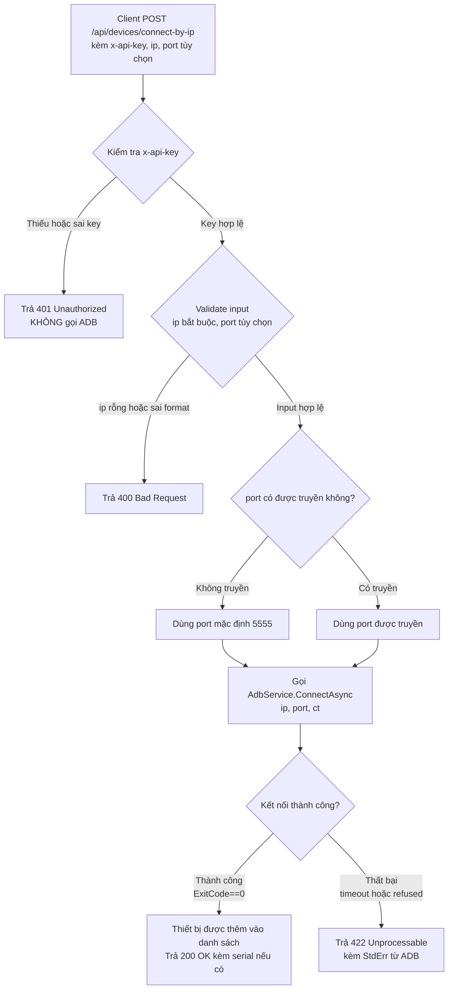
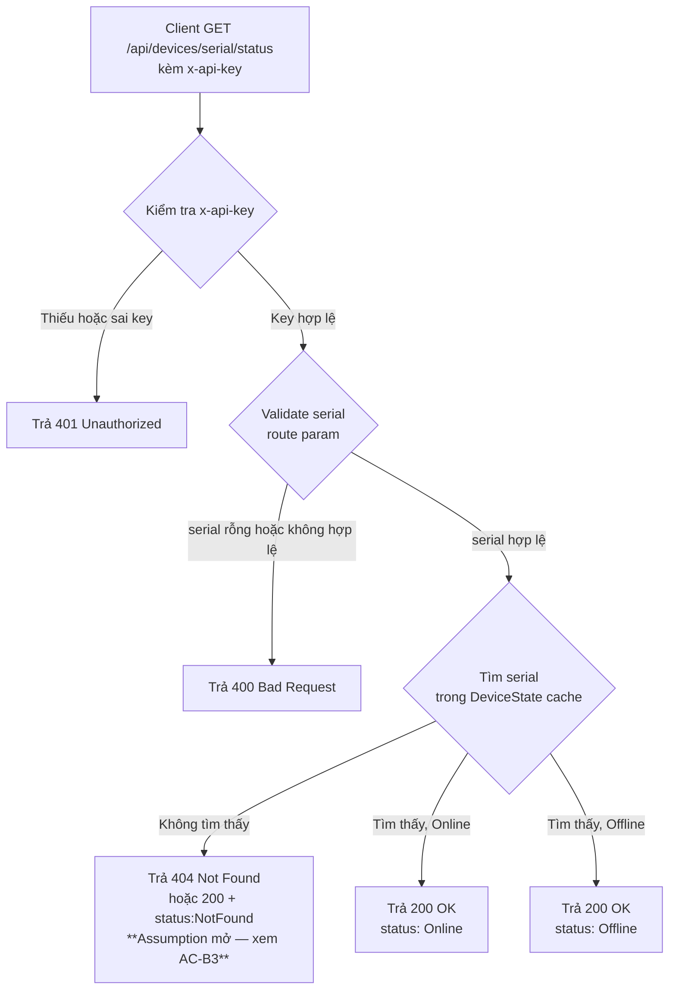

# US-adb-add-device-api: API Kết Nối Thiết Bị theo IP và Kiểm Tra Trạng Thái Kết Nối ADB

## User Story

Là **hệ thống CI/CD / script tự động hóa triển khai**, tôi muốn **(1) gọi một HTTP endpoint để kết nối thiết bị Android theo địa chỉ IP:port mà không cần thao tác thủ công trên UI, và (2) gọi một HTTP endpoint khác để xác nhận thiết bị đó đang online theo serial**, để **hoàn thành vòng lặp tự động hóa end-to-end: thêm thiết bị → kết nối ADB → kiểm tra trạng thái → tiến hành install/launch APK**.

---

## Business Flow

### API 1 — `POST /api/devices/connect-by-ip`

### API 2 — `GET /api/devices/{serial}/status`

---

## Acceptance Criteria

### Phần A — `POST /api/devices/connect-by-ip`

---

### SC-A1: Connect thành công — không truyền port (dùng mặc định 5555)

**Given** client có `x-api-key` đúng với giá trị trong config,  
**And** `ip` là địa chỉ IPv4 hợp lệ (VD: `"192.168.1.100"`) của thiết bị đang lắng nghe ADB,  
**And** request body **không truyền trường `port`**,  
**When** client gọi `POST /api/devices/connect-by-ip` với body `{ "ip": "192.168.1.100" }`,  
**Then** server tự áp dụng `port = 5555`,  
**And** server gọi `AdbService.ConnectAsync("192.168.1.100", 5555, ct)`,  
**And** `AdbCommandResult.ExitCode == 0`,  
**And** server trả HTTP **200 OK** kèm thông tin: trạng thái thành công.

> **BR1 — Port mặc định:** Nếu `port` không được truyền trong body, server PHẢI dùng `5555` làm mặc định, không yêu cầu client truyền tường minh.

---

### SC-A2: Connect thành công — có truyền port tường minh

**Given** client có `x-api-key` đúng,  
**And** `ip` hợp lệ và thiết bị đang lắng nghe ADB,  
**And** `port` được truyền tường minh (VD: `8888`),  
**When** client gọi `POST /api/devices/connect-by-ip` với body `{ "ip": "192.168.1.100", "port": 8888 }`,  
**Then** server gọi `AdbService.ConnectAsync("192.168.1.100", 8888, ct)` (không dùng 5555),  
**And** `AdbCommandResult.ExitCode == 0`,  
**And** server trả HTTP **200 OK** kèm thông tin thành công.

---

### SC-A3: Sai hoặc thiếu API key — 401

**Given** client gọi `POST /api/devices/connect-by-ip`,  
**And** header `x-api-key` bị thiếu hoặc có giá trị không khớp với config,  
**When** request đến server,  
**Then** server trả HTTP **401 Unauthorized** ngay lập tức,  
**And** server **không** gọi `AdbService` hay bất kỳ logic ADB nào,  
**And** response body chứa thông báo lỗi rõ ràng (VD: `"Unauthorized"` hoặc `"Invalid API key"`).

---

### SC-A4: Thiếu trường `ip` bắt buộc — 400

**Given** client có `x-api-key` đúng,  
**And** request body **không có trường `ip`** (hoặc `ip` là chuỗi rỗng `""`),  
**When** client gọi `POST /api/devices/connect-by-ip`,  
**Then** server trả HTTP **400 Bad Request**,  
**And** response body chứa thông báo mô tả trường `ip` là bắt buộc,  
**And** server **không** gọi `AdbService`.

> **BR2 — Validation ip:** `ip` không được rỗng hoặc chỉ chứa khoảng trắng. Mức kiểm tra format IP (regex IPv4 nghiêm ngặt hay chỉ non-empty) do Tech Lead quyết định ở TDD.

---

### SC-A5: IP sai định dạng — 400

**Given** client có `x-api-key` đúng,  
**And** `ip` được truyền nhưng có định dạng không hợp lệ (VD: `"abc"`, `"999.999.999.999"`, `"192.168.1"`),  
**When** client gọi `POST /api/devices/connect-by-ip`,  
**Then** server trả HTTP **400 Bad Request**,  
**And** response body mô tả lý do (VD: `"ip không đúng định dạng IPv4"`),  
**And** server **không** gọi `AdbService`.

> **Assumption mở (Tech Lead xác nhận ở TDD):** Mức validation IP — chỉ non-empty hay validate theo regex IPv4 đầy đủ. Nếu chỉ non-empty thì SC-A5 merge vào SC-A4.

---

### SC-A6: ADB connect thất bại — thiết bị không phản hồi

**Given** client có `x-api-key` đúng,  
**And** `ip` hợp lệ về định dạng nhưng thiết bị không phản hồi (timeout, refused, không có ADB daemon chạy),  
**When** client gọi `POST /api/devices/connect-by-ip`,  
**Then** server gọi `AdbService.ConnectAsync(ip, port, ct)`,  
**And** `AdbCommandResult.ExitCode != 0` hoặc `StdErr` chứa thông báo lỗi từ ADB (VD: `"failed to connect"`, `"Connection refused"`),  
**And** server trả HTTP **422 Unprocessable Entity**,  
**And** response body chứa thông báo lỗi rõ ràng từ ADB (`StdErr`) để client biết nguyên nhân.

---

### SC-A7: Connect lại thiết bị đã kết nối (idempotent)

**Given** client có `x-api-key` đúng,  
**And** thiết bị với `ip:port` này **đã được kết nối trước đó** và đang trong danh sách theo dõi,  
**When** client gọi lại `POST /api/devices/connect-by-ip` với cùng `ip` và `port`,  
**Then** server gọi `AdbService.ConnectAsync(ip, port, ct)` (hành vi idempotent của ADB: `already connected`),  
**And** `AdbCommandResult.ExitCode == 0` (ADB không coi đây là lỗi),  
**And** server trả HTTP **200 OK** — không gây lỗi, không trạng thái bất ngờ.

> **Assumption mở Q2 (Tech Lead xác nhận ở TDD):** `AdbService.ConnectAsync` có trả về serial của thiết bị sau khi kết nối thành công không? Nếu có — serial nên được bao gồm trong response để client có thể dùng ngay cho API 2. Nếu không — client cần cách khác để lấy serial.

---

### Phần B — `GET /api/devices/{serial}/status`

---

### SC-B1: Serial tồn tại và Online — 200

**Given** client có `x-api-key` đúng,  
**And** `serial` tồn tại trong `DeviceState` cache (được sync bởi `DevicePollWorker`),  
**And** `DeviceState` của serial đó có `Status == Online`,  
**When** client gọi `GET /api/devices/{serial}/status`,  
**Then** server đọc `DeviceState` cache (không gọi ADB trực tiếp),  
**And** server trả HTTP **200 OK** kèm response JSON `{ "status": "Online" }`.

---

### SC-B2: Serial tồn tại nhưng đang Offline — 200

**Given** client có `x-api-key` đúng,  
**And** `serial` tồn tại trong `DeviceState` cache,  
**And** `DeviceState` của serial đó có `Status == Offline` (thiết bị đã mất kết nối ADB),  
**When** client gọi `GET /api/devices/{serial}/status`,  
**Then** server đọc `DeviceState` cache (không gọi ADB trực tiếp),  
**And** server trả HTTP **200 OK** kèm response JSON `{ "status": "Offline" }`.

---

### SC-B3: Serial không tồn tại trong danh sách theo dõi

**Given** client có `x-api-key` đúng,  
**And** `serial` **không có** trong `DeviceState` cache (chưa bao giờ kết nối hoặc đã bị xóa),  
**When** client gọi `GET /api/devices/{serial}/status`,  
**Then** server trả phản hồi chỉ rõ serial không được tìm thấy.

> **Assumption mở — AC8 (Tech Lead quyết định ở TDD):**
> - **Phương án A (khuyến nghị, RESTful):** Trả HTTP **404 Not Found** kèm body `{ "message": "Device '{serial}' not found" }` — rõ ràng hơn về mặt ngữ nghĩa REST.
> - **Phương án B:** Trả HTTP **200 OK** kèm body `{ "status": "NotFound" }` — đồng nhất HTTP status nhưng ẩn đi sự phân biệt "không tìm thấy" vs "offline".
>
> BA đề xuất Phương án A (404). Tech Lead xác nhận tại STEP-2.1 TDD và cập nhật AC này.

---

### SC-B4: Serial rỗng hoặc chỉ chứa khoảng trắng — 400

**Given** client có `x-api-key` đúng,  
**And** route param `serial` là chuỗi rỗng (VD: route `/api/devices//status`) hoặc chỉ chứa khoảng trắng,  
**When** client gọi endpoint,  
**Then** server trả HTTP **400 Bad Request**,  
**And** response body mô tả lý do (VD: `"serial không được rỗng"`),  
**And** server **không** truy vấn `DeviceState`.

> **Ghi chú kỹ thuật:** ASP.NET Core routing có thể tự không match route nếu serial rỗng (404 từ router, không phải 400 từ validation logic). Tech Lead xác nhận hành vi thực tế ở TDD.

---

### SC-B5: Sai hoặc thiếu API key — 401

**Given** client gọi `GET /api/devices/{serial}/status`,  
**And** header `x-api-key` bị thiếu hoặc có giá trị không khớp với config,  
**When** request đến server,  
**Then** server trả HTTP **401 Unauthorized** ngay lập tức,  
**And** server **không** truy vấn `DeviceState`.

---

### Phần C — Chung (cả 2 API)

---

### SC-C1: Route cũ không bị ảnh hưởng bởi auth mới

**Given** các route cũ (`/api/install`, `/api/launch-app`, `/api/devices/connect` nội bộ, ...) đang hoạt động bình thường,  
**And** cơ chế `x-api-key` được triển khai chỉ cho 2 endpoint mới,  
**When** client gọi route cũ (VD: `POST /api/install`) **mà không có** header `x-api-key`,  
**Then** request được xử lý bình thường như trước khi có feature này,  
**And** server **không** trả 401 cho route cũ,  
**And** không có regression nào trên hành vi hiện tại của các route cũ.

> **BR3:** `ApiKeyEndpointFilter` (hoặc middleware auth tương tự) của 2 endpoint mới PHẢI được scope cứng vào endpoint đó — KHÔNG dùng global middleware bao toàn bộ app.

---

### SC-C2: API key có thể override bằng biến môi trường — không cần rebuild

**Given** API key được cấu hình trong `appsettings.json` với giá trị mặc định,  
**When** operator đặt biến môi trường `LaunchApp__ApiKey=<new-key>` trước khi khởi động container/process,  
**Then** server đọc key từ biến môi trường, bỏ qua giá trị trong `appsettings.json`,  
**And** cả 2 endpoint mới hoạt động đúng với key mới mà không cần rebuild image hay restart toàn bộ service.

> **BR4:** Tái sử dụng đúng key config `LaunchApp:ApiKey` đang có — KHÔNG tạo section config mới hay API key mới.

---

## Quy tắc nghiệp vụ tổng hợp

| # | Quy tắc |
|---|---------|
| BR1 | Nếu `port` không được truyền trong body, server dùng `5555` làm mặc định |
| BR2 | `ip` là trường bắt buộc, không được rỗng; mức validate format do Tech Lead quyết định ở TDD |
| BR3 | Auth `x-api-key` CHỈ áp cho 2 endpoint mới — KHÔNG áp cho route cũ |
| BR4 | Tái sử dụng key config `LaunchApp:ApiKey` đang có; hỗ trợ override bằng biến môi trường |
| BR5 | Endpoint kiểm tra trạng thái CHỈ đọc `DeviceState` cache — KHÔNG gọi ADB trực tiếp |
| BR6 | Tái sử dụng `AdbService.ConnectAsync` — KHÔNG gọi trực tiếp lệnh `adb connect` bằng cơ chế khác |

---

## Edge Cases

| # | Mô tả | Xử lý mong đợi |
|---|-------|----------------|
| EC1 | Lỗi mạng: ADB connect bắt đầu nhưng bị ngắt giữa chừng | `AdbCommandResult.ExitCode != 0`, `StdErr` chứa thông tin lỗi → 422 |
| EC2 | `DeviceState` cache cũ — `DevicePollWorker` poll chậm, trạng thái trả về có thể lệch thực tế | Chấp nhận được (eventual consistency); Tech Lead ghi rõ chu kỳ poll ở TDD |
| EC3 | Hai request đồng thời connect cùng IP:port | Mỗi request độc lập; ADB xử lý idempotent (`already connected`); không cần lock ở server |
| EC4 | ADB binary không tìm thấy trên server (`_adbPath` sai) | `AdbCommandResult.ExitCode = -1`, `StdErr = "Không tìm thấy adb tại: ..."` → 422 + thông báo lỗi hệ thống |
| EC5 | `port` được truyền với giá trị ngoài range hợp lệ (VD: `0`, `65536`, `-1`) | Validate → 400 Bad Request; Tech Lead quyết định range hợp lệ ở TDD |
| EC6 | `ip` là chuỗi chỉ có khoảng trắng (`"   "`) | Normalize → rỗng → 400 Bad Request (BR2) |
| EC7 | `serial` trong route param chứa ký tự đặc biệt (VD: `:`, `/`) | URL encoding; ASP.NET Core routing xử lý; Tech Lead xác nhận ở TDD |
| EC8 | Hết phiên (session/token expire) | Không áp dụng — auth bằng static API key, không có session |

---

## Câu hỏi mở cho Tech Lead (STEP-2.1 TDD)

| # | Câu hỏi | Người trả lời | Ghi chú |
|---|---------|--------------|---------|
| Q1 | `AdbService.ConnectAsync` có trả về serial của thiết bị sau khi kết nối thành công không? Nếu có → serial nên trả về trong response endpoint 1 để client dùng ngay cho API 2 | Tech Lead — STEP-2.1 | Ảnh hưởng đến response schema SC-A1, SC-A2, SC-A7 |
| Q2 | HTTP 404 hay HTTP 200 + `status: "NotFound"` cho serial không tồn tại (SC-B3 / AC8)? | Tech Lead — STEP-2.1 | BA đề xuất 404 (RESTful rõ hơn); assumption hiện tại: 404 |
| Q3 | Mức validate format `ip`: chỉ non-empty hay regex IPv4 đầy đủ? | Tech Lead — STEP-2.1 | Ảnh hưởng đến xử lý SC-A5 |
| Q4 | `port` range hợp lệ: `1–65535` hay cho phép rộng hơn? | Tech Lead — STEP-2.1 | EC5 |
| Q5 | Response schema endpoint 1 khi thành công: chỉ `{ success, message }` hay bao gồm cả `stdOut`/`stdErr`/`serial`? | Tech Lead — STEP-2.1 | Xác nhận Q1 trước |
| Q6 | Hành vi ASP.NET Core khi `serial` trong route param rỗng — router 404 hay validation logic 400? | Tech Lead — STEP-2.1 | SC-B4; có thể là GOTCHA routing |
| Q7 | Tên biến môi trường override API key: `LaunchApp__ApiKey` (dấu `__` đôi) hay ký hiệu khác trên platform Linux/Docker? | Tech Lead — STEP-2.1 | SC-C2; xác nhận convention ASP.NET Core trên Linux |

---

*Tài liệu này do Business Analyst tạo ngày 2026-08-19. Review bởi Product Manager trước khi chuyển Tech Lead.*
