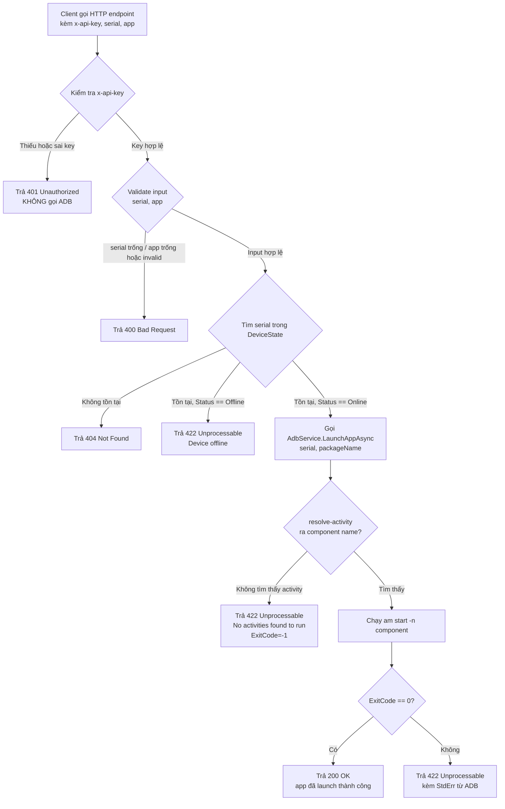

# US-adb-launch-app-api: API Launch App Android qua ADB

## User Story

Là **hệ thống CI/CD / script tự động hóa triển khai**, tôi muốn **gọi một HTTP endpoint để ra lệnh bật (launch) một ứng dụng Android trên thiết bị đích theo serial**, để **hoàn thành vòng lặp deploy end-to-end: install APK → launch app → xác nhận app đã khởi động mà không cần can thiệp thủ công vào thiết bị**.

---

## Business Flow

---

## Acceptance Criteria

### SC-01: Happy path — Launch thành công

**Given** client có `x-api-key` đúng với giá trị trong config,  
**And** `serial` tồn tại trong `DeviceState` với `Status == "Online"`,  
**And** `app` là package name hợp lệ (không rỗng, đúng định dạng, đã được cài trên thiết bị),  
**When** client gọi endpoint launch app với ba tham số trên,  
**Then** server gọi `AdbService.LaunchAppAsync(serial, packageName, ct)`,  
**And** `AdbCommandResult.ExitCode == 0` (`Success == true`),  
**And** server trả HTTP **200** kèm thông tin: trạng thái thành công, `StdOut` từ ADB.

---

### SC-02: Sai hoặc thiếu API key — 401

**Given** client gọi endpoint launch app,  
**And** header `x-api-key` bị thiếu hoặc có giá trị không khớp với config,  
**When** request đến server,  
**Then** server trả HTTP **401 Unauthorized** ngay lập tức,  
**And** server **không** gọi `AdbService` hay bất kỳ logic ADB nào,  
**And** response body chứa thông báo lỗi rõ ràng (VD: "Unauthorized" hoặc "Invalid API key").

---

### SC-03: `serial` không tồn tại trong hệ thống — 404

**Given** client có `x-api-key` đúng,  
**And** `serial` được gửi **không có** trong `DeviceState` (chưa bao giờ kết nối hoặc đã bị xóa),  
**When** client gọi endpoint launch app với serial đó,  
**Then** server trả HTTP **404 Not Found**,  
**And** response body chứa thông báo chỉ rõ serial không tìm thấy (VD: `"Device '{serial}' not found"`),  
**And** server **không** gọi `AdbService`.

---

### SC-04: `app` (package name) trống hoặc không hợp lệ — 400

**Given** client có `x-api-key` đúng,  
**And** `serial` tồn tại và Online,  
**And** `app` bị trống (`""`) hoặc chứa ký tự không hợp lệ cho package name Android (VD: có dấu cách, bắt đầu bằng số, chỉ có một segment không có dấu `.`),  
**When** client gọi endpoint launch app,  
**Then** server trả HTTP **400 Bad Request**,  
**And** response body chứa thông báo mô tả trường nào không hợp lệ,  
**And** server **không** gọi `AdbService`.

> **BR1 — Quy tắc validation package name tối thiểu:**  
> - Không được rỗng hoặc chỉ chứa khoảng trắng.  
> - Phải có ít nhất một dấu `.` phân tách (VD: `com.example` hợp lệ; `myapp` không hợp lệ).  
> - Không chứa khoảng trắng.  
> *(Tech Lead quyết định mức validation chặt hơn ở TDD nếu cần.)*

---

### SC-05: Thiết bị tồn tại trong hệ thống nhưng đang Offline — 422

**Given** client có `x-api-key` đúng,  
**And** `serial` tồn tại trong `DeviceState` nhưng `Status == "Offline"` (thiết bị đã mất kết nối ADB),  
**And** `app` hợp lệ,  
**When** client gọi endpoint launch app,  
**Then** server trả HTTP **422 Unprocessable Entity**,  
**And** response body chứa thông báo rõ ràng rằng thiết bị đang offline (VD: `"Device '{serial}' is offline"`),  
**And** server **không** gọi `AdbService.LaunchAppAsync` (tránh ADB timeout không cần thiết).

> **BR2:** Phân biệt rõ SC-03 (serial chưa từng biết → 404) với SC-05 (serial đã biết nhưng offline → 422).  
> Điều này cho phép client CI/CD xử lý hai trường hợp khác nhau: "sai serial" vs "thiết bị tạm thời offline".

---

### SC-06: Package chưa cài trên thiết bị — 422 (ADB lỗi)

**Given** client có `x-api-key` đúng,  
**And** `serial` tồn tại và `Status == "Online"`,  
**And** `app` hợp lệ về cú pháp nhưng **chưa được cài** trên thiết bị,  
**When** client gọi endpoint launch app,  
**Then** server gọi `AdbService.LaunchAppAsync(serial, packageName, ct)`,  
**And** `resolve-activity` không tìm thấy component → `AdbCommandResult.ExitCode == -1`, `StdErr == "No activities found to run"`,  
**And** server trả HTTP **422 Unprocessable Entity**,  
**And** response body chứa thông báo lỗi từ ADB (bao gồm `"No activities found to run"`) để client biết rõ nguyên nhân.

---

### SC-07: Route cũ không bị ảnh hưởng bởi auth mới

**Given** các route cũ (VD: `POST /api/install`, `GET /api/devices`, ...) đang hoạt động bình thường,  
**And** cơ chế `x-api-key` được triển khai chỉ cho endpoint launch app mới,  
**When** client gọi `POST /api/install` (hoặc bất kỳ route cũ nào) **mà không có** header `x-api-key`,  
**Then** request được xử lý bình thường như trước khi có feature này,  
**And** server **không** trả 401 cho route cũ,  
**And** không có regression nào trên hành vi hiện tại của các route cũ.

> **BR3:** Auth middleware (hoặc filter) của endpoint launch app **PHẢI** được scope cứng vào endpoint mới — KHÔNG dùng global middleware bao toàn bộ app.

---

### SC-08: API key có thể override bằng biến môi trường — không cần rebuild

**Given** API key được cấu hình trong `appsettings.json` với giá trị mặc định,  
**When** operator đặt biến môi trường tương ứng (VD: `LaunchApp__ApiKey=<new-key>`) trước khi khởi động container/process,  
**Then** server đọc key từ biến môi trường, bỏ qua giá trị trong `appsettings.json`,  
**And** endpoint hoạt động đúng với key mới mà không cần rebuild image hay restart toàn bộ service.

> **BR4:** Tên biến môi trường cụ thể và section config (`appsettings.json`) do Tech Lead quyết định ở TDD (STEP-2.1).

---

## Quy tắc nghiệp vụ tổng hợp

| # | Quy tắc |
|---|---------|
| BR1 | Package name phải có ít nhất 1 dấu `.`, không rỗng, không chứa khoảng trắng |
| BR2 | Phân biệt 404 (serial không tồn tại) và 422 (serial tồn tại nhưng offline) |
| BR3 | Auth `x-api-key` CHỈ áp cho endpoint launch app — KHÔNG áp cho route cũ |
| BR4 | API key đọc từ config ASP.NET Core, hỗ trợ override bằng biến môi trường |
| BR5 | Không thực hiện lệnh ADB khi thiết bị offline (tránh timeout 10s không cần thiết) |
| BR6 | Tái sử dụng `AdbService.LaunchAppAsync` — KHÔNG gọi trực tiếp `adb shell monkey` hay lệnh ADB tùy tiện |

---

## Edge Cases

| # | Mô tả | Xử lý mong đợi |
|---|-------|----------------|
| EC1 | Lỗi mạng: thiết bị bị ngắt kết nối giữa lúc check DeviceState (Online) và gọi ADB → ADB timeout sau 10s | Server trả 422 với `StdErr` chứa "timeout" từ `AdbCommandResult` |
| EC2 | `app` là chuỗi chỉ có khoảng trắng (`"   "`) | Normalize → rỗng → 400 Bad Request |
| EC3 | Hai request đồng thời launch cùng serial+app | Mỗi request xử lý độc lập; ADB xử lý idempotent — không cần lock |
| EC4 | ADB binary không tìm thấy trên server (`_adbPath` sai) | `AdbCommandResult.ExitCode = -1`, `StdErr = "Không tìm thấy adb tại: ..."` → 422 + thông báo lỗi hệ thống |
| EC5 | Package name có ký tự unicode hoặc uppercase lẫn lộn | Tuỳ Tech Lead: document hành vi ADB; khuyến nghị normalize lowercase trước khi gọi |
| EC6 | `serial` là chuỗi rỗng | Validate input → 400 Bad Request (serial là trường bắt buộc) |
| EC7 | App đã launch sẵn trên thiết bị, gọi lại endpoint | `am start` mang lại hành vi bring-to-foreground hoặc restart tùy `am start` flag — ADB trả ExitCode=0 → 200 OK |

---

## Câu hỏi mở cho Tech Lead (STEP-2.1 TDD)

| # | Câu hỏi | Người trả lời |
|---|---------|--------------|
| Q1 | HTTP verb cho endpoint: `POST` (body JSON) hay `GET` (query params)? | Tech Lead — STEP-2.1 |
| Q2 | Response schema: chỉ trả `{ success, message }` hay bao gồm cả `stdOut`/`stdErr` từ `AdbCommandResult`? | Tech Lead — STEP-2.1 |
| Q3 | Tên key trong `appsettings.json` và tên biến môi trường override (VD: `LaunchApp__ApiKey` hay khác)? | Tech Lead — STEP-2.1 |
| Q4 | Validation package name: chỉ check "có dấu `.`" và "không rỗng" (BR1), hay validate theo regex Android package naming đầy đủ? | Tech Lead — STEP-2.1 |
| Q5 | EC7: Khi app đã chạy sẵn, `am start` restart hay bring-to-foreground? Có cần thêm flag `-S` (force stop trước) không? | Tech Lead — STEP-2.1 |

---

*Tài liệu này do Business Analyst tạo ngày 2026-08-18. Review bởi Product Manager trước khi chuyển Tech Lead.*
