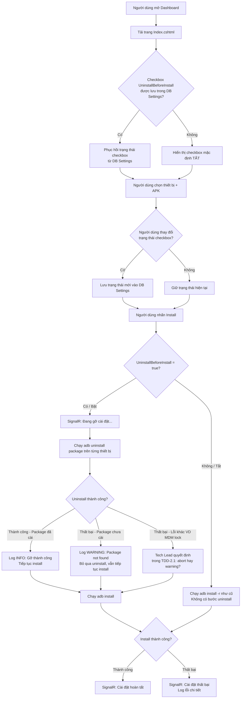

# User Stories: Tùy chọn Gỡ cài đặt App trước khi Cài đặt (Uninstall Before Install)

> **Nguồn:** PRD `docs/prd/PRD-adb-uninstall-before-install.md`
> **BA:** Business Analyst — STEP-1.2 trong plan `docs/plans/PLAN-adb-uninstall-before-install-2026-08-20/`
> **Ngày:** 2026-08-20

---

## Business Flow



---

## US-001: Hành vi mặc định — Checkbox tắt, chỉ install không uninstall

**Là** nhân viên vận hành /
**Tôi muốn** hành vi cài đặt APK mặc định KHÔNG thay đổi sau khi tính năng được thêm vào /
**Để** đảm bảo quy trình deploy bình thường không bị ảnh hưởng nếu tôi chưa cần dùng tùy chọn mới.

### Acceptance Criteria

**Scenario 1 (Happy path) — Checkbox tắt, Install chạy đúng hành vi cũ**
```
Given  Dashboard đang hiển thị, checkbox "Gỡ cài đặt trước khi cài" đang TẮT (mặc định)
       AND  Người dùng đã chọn ít nhất 1 thiết bị và chọn file APK hợp lệ
When   Người dùng nhấn nút Install
Then   Server KHÔNG chạy lệnh adb uninstall ở bất kỳ bước nào
       AND  Server chạy adb install -r <apk> như hành vi hiện tại
       AND  SignalR KHÔNG hiển thị bước "Đang gỡ cài đặt..." trong tiến trình
       AND  Kết quả install (thành công/thất bại) giống hoàn toàn hành vi trước khi tính năng được thêm
```

**Scenario 2 (Negative) — Checkbox tắt không được gửi flag uninstall lên server**
```
Given  Checkbox "Gỡ cài đặt trước khi cài" đang TẮT
When   JavaScript gửi request Install lên server (qua apiPost)
Then   Payload gửi lên có trường uninstallBeforeInstall = false (hoặc không có trường này)
       AND  Server xử lý request mà không gọi UninstallApkAsync
```

---

## US-002: Checkbox bật + Package đã cài — Uninstall thành công rồi Install

**Là** nhân viên vận hành /
**Tôi muốn** bật tùy chọn "Gỡ cài đặt trước khi cài" trước khi nhấn Install /
**Để** hệ thống tự động gỡ phiên bản cũ khỏi thiết bị trước khi cài phiên bản mới, tránh lỗi xung đột certificate hoặc UID.

### Acceptance Criteria

**Scenario 1 (Happy path) — Uninstall thành công, Install tiếp theo thành công**
```
Given  Checkbox "Gỡ cài đặt trước khi cài" đang BẬT
       AND  Thiết bị đang kết nối và đang cài đặt package <com.example.app>
       AND  Người dùng đã chọn thiết bị và file APK hợp lệ
When   Người dùng nhấn Install
Then   Dashboard hiển thị bước tiến trình "Đang gỡ cài đặt..." qua SignalR trước các bước install
       AND  Server chạy adb uninstall com.example.app thành công (exit code 0)
       AND  Log ghi nhận: "Uninstall <com.example.app> thành công" ở mức INFO
       AND  Server tiếp tục chạy adb install -r <apk> ngay sau uninstall
       AND  Kết quả cuối cùng: Install thành công, Dashboard hiển thị trạng thái hoàn tất
```

**Scenario 2 (Verify sequence) — Thứ tự lệnh ADB phải là uninstall TRƯỚC install**
```
Given  Checkbox "Gỡ cài đặt trước khi cài" đang BẬT
       AND  Package đã cài trên thiết bị
When   Người dùng nhấn Install
Then   Lệnh adb uninstall được gọi và hoàn tất TRƯỚC khi lệnh adb install được gọi
       AND  Không có thiết bị nào được install trước khi bước uninstall hoàn tất trên thiết bị đó
```

---

## US-003: Checkbox bật + Package chưa cài — Log warning, vẫn Install

**Là** nhân viên vận hành /
**Tôi muốn** hệ thống vẫn tiếp tục cài đặt dù app chưa có trên thiết bị khi tôi bật tùy chọn gỡ cài đặt /
**Để** quy trình deploy không bị abort chỉ vì thiết bị chưa từng cài app trước đó (VD: thiết bị mới xuất xưởng).

### Acceptance Criteria

**Scenario 1 (Edge case — Graceful skip) — Package chưa cài, hệ thống bỏ qua uninstall và tiếp tục**
```
Given  Checkbox "Gỡ cài đặt trước khi cài" đang BẬT
       AND  Package <com.example.app> CHƯA được cài trên thiết bị
       AND  adb uninstall trả về lỗi dạng "Failure [DELETE_FAILED_INTERNAL_ERROR]"
            hoặc exit code khác 0 do package not found
When   Người dùng nhấn Install
Then   Server ghi log WARNING: "Không tìm thấy package <com.example.app> trên thiết bị — bỏ qua uninstall"
       AND  Server KHÔNG abort luồng install
       AND  Server tiếp tục chạy adb install -r <apk> bình thường
       AND  Dashboard KHÔNG hiển thị trạng thái lỗi nghiêm trọng do bước uninstall thất bại
       AND  Nếu install thành công sau đó → Dashboard hiển thị trạng thái thành công như bình thường
```

**Scenario 2 (Multiple devices — Mixed state) — Một số thiết bị có package, một số chưa có**
```
Given  Checkbox "Gỡ cài đặt trước khi cài" đang BẬT
       AND  Có 3 thiết bị được chọn: thiết bị A (có package), B (chưa có), C (có package)
When   Người dùng nhấn Install
Then   Thiết bị A: uninstall thành công → install thành công → log INFO
       AND  Thiết bị B: uninstall thất bại (package not found) → log WARNING → install vẫn chạy
       AND  Thiết bị C: uninstall thành công → install thành công → log INFO
       AND  Trạng thái thất bại uninstall của thiết bị B KHÔNG ảnh hưởng đến thiết bị A và C
```

---

## US-004: Checkbox bật + Install thành công sau khi Uninstall

**Là** nhân viên vận hành /
**Tôi muốn** nhìn thấy tiến trình rõ ràng trên Dashboard khi cả hai bước uninstall và install hoàn tất /
**Để** xác nhận quy trình "clean install" đã thực hiện đúng như tôi mong đợi, không cần đoán hệ thống đang làm gì.

### Acceptance Criteria

**Scenario 1 (Happy path — Full flow) — Toàn bộ luồng uninstall → install hiển thị đúng trên Dashboard**
```
Given  Checkbox "Gỡ cài đặt trước khi cài" đang BẬT
       AND  Package đã cài trên thiết bị
       AND  Người dùng đã chọn thiết bị và APK hợp lệ
When   Người dùng nhấn Install và luồng hoàn tất thành công
Then   Dashboard hiển thị tuần tự qua SignalR:
         Bước 1: "Đang gỡ cài đặt <package>..." (MỚI — thêm vào đầu luồng tiến trình)
         Bước 2: Các bước tiến trình install hiện tại (đang upload / đang cài đặt / ...)
         Bước 3: "Cài đặt hoàn tất" hoặc tương đương
       AND  Không có bước nào bị bỏ qua hoặc hiển thị sai thứ tự
       AND  Toàn bộ thiết bị được chọn đều đi qua cả 2 bước (uninstall → install) thành công
```

**Scenario 2 (Verify timing) — Thời gian thêm của bước uninstall được phản ánh trong UX**
```
Given  Checkbox "Gỡ cài đặt trước khi cài" đang BẬT
       AND  Thiết bị đang kết nối
When   Người dùng nhấn Install
Then   Bước "Đang gỡ cài đặt..." xuất hiện ngay khi bắt đầu (không có khoảng trống im lặng)
       AND  Bước tiến trình install tiếp theo chỉ xuất hiện SAU khi uninstall đã hoàn thành
       AND  Người dùng không thể nhầm tưởng hệ thống bị treo trong khoảng thời gian uninstall
```

---

## US-005: Trạng thái Checkbox được lưu giữa các lần load trang

**Là** nhân viên vận hành /
**Tôi muốn** trạng thái tùy chọn "Gỡ cài đặt trước khi cài" được ghi nhớ sau khi tôi tải lại trang /
**Để** không phải bật lại mỗi lần mở Dashboard trong các phiên deploy liên tiếp.

> **Lưu ý:** AC này phụ thuộc quyết định của Tech Lead tại TDD (Bước 2.1) về việc lưu DB Settings. Scenario được viết theo đề xuất CÓ lưu (nhất quán với PackageName/ApkPath); nếu Tech Lead quyết định KHÔNG lưu, scenario này sẽ được cập nhật lại.

### Acceptance Criteria

**Scenario 1 (Happy path — Persist) — Checkbox BẬT được ghi nhớ sau khi tải lại**
```
Given  Người dùng đã bật checkbox "Gỡ cài đặt trước khi cài" (checked = true)
       AND  Trạng thái đã được ghi vào DB Settings (key: UninstallBeforeInstall, value: true)
When   Người dùng tải lại trang (F5 hoặc điều hướng về Dashboard)
Then   Checkbox hiển thị ở trạng thái BẬT (checked) ngay khi trang load xong
       AND  Người dùng không cần bật lại thủ công
```

**Scenario 2 (Happy path — Persist off) — Checkbox TẮT cũng được ghi nhớ**
```
Given  Người dùng đã tắt checkbox "Gỡ cài đặt trước khi cài" (checked = false)
       AND  Trạng thái đã được ghi vào DB Settings (key: UninstallBeforeInstall, value: false)
When   Người dùng tải lại trang
Then   Checkbox hiển thị ở trạng thái TẮT (unchecked)
       AND  Không có hành động uninstall nào được kích hoạt trong phiên mới
```

**Scenario 3 (First load — No saved state) — Lần đầu load khi chưa có giá trị trong DB**
```
Given  Đây là lần đầu trang được load sau khi deploy phiên bản mới (key UninstallBeforeInstall
       chưa tồn tại trong DB Settings)
When   Trang Dashboard load
Then   Checkbox hiển thị ở trạng thái TẮT (false) theo mặc định
       AND  Hành vi giữ nguyên như hành vi cũ trước khi tính năng được thêm
```

---

## Quy tắc nghiệp vụ

- **BR1:** Hành vi mặc định (checkbox TẮT) PHẢI giống hoàn toàn với hành vi hiện tại — không có tác dụng phụ nào khi user chưa bật tùy chọn.
- **BR2:** Khi bật tùy chọn, lệnh `adb uninstall <package>` PHẢI chạy trên đúng package name lấy từ APK đang deploy — không tự suy ra package name từ nguồn khác.
- **BR3:** Lỗi uninstall do "package not found" (exit code khác 0, output chứa dấu hiệu package không tồn tại) PHẢI được xử lý như WARNING, KHÔNG phải ERROR nghiêm trọng — luồng install tiếp tục.
- **BR4:** Bước uninstall PHẢI hoàn tất trên một thiết bị trước khi bước install bắt đầu trên thiết bị đó — không song song uninstall và install trên cùng một thiết bị.
- **BR5:** Tùy chọn uninstall KHÔNG áp dụng cho luồng auto-detect — hai tính năng hoạt động độc lập.
- **BR6:** Trạng thái checkbox được lưu vào DB Settings theo cơ chế nhất quán với PackageName/ApkPath hiện có — Tech Lead xác nhận field name và cơ chế lưu trong TDD (Bước 2.1).

---

## Edge cases cần xử lý

- **EC1 (Lỗi ADB — Lý do ngoài "package not found"):** adb uninstall thất bại do MDM lock, thiết bị offline bất ngờ, quyền hạn thiếu — Tech Lead quyết định trong TDD: abort hay tiếp tục? (xem R1 trong PRD).
- **EC2 (Package name rỗng/không xác định được):** APK không có manifest hợp lệ, không đọc được package name — xử lý giống lỗi install hiện tại, không thực hiện uninstall.
- **EC3 (Thiết bị mất kết nối giữa bước uninstall và install):** Xử lý giống hành vi mất kết nối hiện tại trong luồng install — không cần xử lý mới đặc thù cho uninstall.
- **EC4 (Nhiều thiết bị — Isolation):** Lỗi uninstall trên thiết bị A KHÔNG được làm abort cả batch — mỗi thiết bị xử lý độc lập.
- **EC5 (DB Settings không khả dụng khi load trang):** Nếu không đọc được giá trị từ DB Settings, fallback về mặc định TẮT (false) — không throw exception, không crash Dashboard.

---

## Câu hỏi mở cho PM / Tech Lead

- **Q1 (Tech Lead — TDD 2.1):** Vị trí chính xác của checkbox trên toolbar — trước hay sau checkbox auto-detect? (xem Q1 trong PRD). User story giả định checkbox xuất hiện trong khu vực toolbar options hiện tại, vị trí cụ thể chờ Tech Lead chốt.
- **Q2 (Tech Lead — TDD 2.1):** Cơ chế phân biệt lỗi "package not found" vs lỗi ADB thực sự (EC1) trong `UninstallApkAsync` — parse stdout/stderr hay kiểm tra exit code? Quyết định này ảnh hưởng trực tiếp đến BR3 và EC1.
- **Q3 (PM confirm):** AC5 (lưu DB Settings) đã được ghi vào PRD như AC chính thức — Tech Lead xác nhận cơ chế lưu (field name, scope: per-user hay global) trong TDD. User story đã viết 3 scenario theo hướng CÓ lưu; nếu Tech Lead quyết định KHÔNG lưu, scenario 1 và 2 của US-005 sẽ được cập nhật lại.
