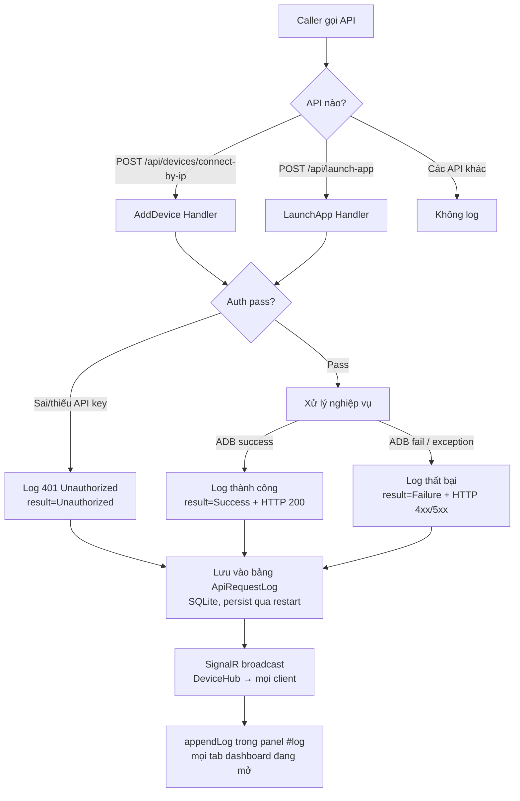

# User Stories: API Request Log — Ghi lịch sử & hiển thị real-time cho AddDevice/LaunchApp API

> **Nguồn:** PRD `docs/prd/PRD-api-request-log.md`
> **BA:** Business Analyst — STEP-1.2 trong plan `docs/plans/PLAN-api-request-log-2026-08-19/`
> **Ngày:** 2026-08-19

---

## Business Flow



---

## US-001: Log request AddDevice API thành công

**Là** operator kỹ thuật /
**Tôi muốn** hệ thống tự động ghi lại mỗi request gọi vào AddDevice API khi kết quả ADB thành công /
**Để** xác nhận CI/CD đã kết nối thiết bị đúng và có audit trail khi cần kiểm tra.

### Acceptance Criteria

**Scenario 1 (Happy path) — Request AddDevice thành công được ghi log đầy đủ**
```
Given  Ứng dụng đang chạy và bảng ApiRequestLog đã sẵn sàng trong SQLite
When   Caller gửi POST /api/devices/connect-by-ip với API key hợp lệ, IP:port hợp lệ,
       và ADB connect thành công (device vào trạng thái connected)
Then   Trong vòng 1 giây sau khi response trả về:
         - 1 bản ghi mới xuất hiện trong bảng ApiRequestLog
         - ApiName = "AddDevice"
         - Parameter chứa IP:port đã gửi (VD: "192.168.1.10:5555")
         - Result = "Success"
         - HttpStatusCode = 200
         - CallerIp = địa chỉ IP thực của caller
         - CreatedAt = timestamp UTC trong khoảng ±5 giây so với thời điểm gọi
       VÀ Response trả về caller KHÔNG thay đổi (logging trong suốt, không ảnh hưởng payload/status)
```

**Scenario 2 (Edge case) — Nhiều request AddDevice liên tiếp không bị bỏ sót**
```
Given  Ứng dụng đang chạy
When   Caller gửi 10 request POST /api/devices/connect-by-ip liên tiếp, đều thành công
Then   Sau khi tất cả 10 request hoàn thành:
         - Bảng ApiRequestLog có đúng 10 bản ghi mới với ApiName = "AddDevice"
         - Không có bản ghi nào bị bỏ sót (tỉ lệ log = 100%)
         - Thứ tự CreatedAt tương ứng với thứ tự gọi
```

**Scenario 3 (Edge case) — AddDevice thành công với IP không chuẩn nhưng ADB chấp nhận**
```
Given  Ứng dụng đang chạy
When   Caller gửi POST /api/devices/connect-by-ip với IP dạng domain name hoặc IPv6 hợp lệ
       mà ADB connect thành công
Then   Log được tạo với Parameter ghi chính xác giá trị IP đã gửi (không normalize/transform)
```

### Quy tắc nghiệp vụ
- **BR1:** Logging là side-effect — KHÔNG làm thay đổi response trả về caller (status code, body, headers giữ nguyên).
- **BR2:** Mỗi request tương ứng đúng 1 bản ghi log — không log 0 lần (miss) hoặc nhiều hơn 1 lần (duplicate).
- **BR3:** CallerIp ghi địa chỉ IP thực của caller; nếu không xác định được thì ghi "unknown".
- **BR4:** Logging thực hiện sau khi handler đã xử lý xong và response được chuẩn bị — không block response.

### Edge cases
- **EC1 (Lỗi ghi DB):** Nếu ghi SQLite thất bại (disk full, lock), logging fail silently — KHÔNG ảnh hưởng response caller; lỗi được ghi vào application log.
- **EC2 (SignalR không có client):** Nếu không có dashboard tab nào đang mở, SignalR broadcast thực hiện bình thường (no-op), bản ghi vẫn được lưu vào SQLite.
- **EC3 (High concurrency):** Nhiều request đến đồng thời — mỗi request vẫn tạo đúng 1 bản ghi; không có race condition gây mất log.

### Câu hỏi mở cho PM / Tech Lead
- **Q1:** Nếu ghi DB thất bại, có cần retry hay chấp nhận miss hoàn toàn? (Hiện tại: fail silently per PRD.)
- **Q2:** CallerIp khi đứng sau reverse proxy / load balancer — cần đọc từ `X-Forwarded-For` header hay `RemoteIpAddress`? (Tech Lead quyết định ở TDD.)

---

## US-002: Log request AddDevice API thất bại

**Là** operator kỹ thuật /
**Tôi muốn** hệ thống ghi lại mỗi request gọi vào AddDevice API khi kết quả thất bại (bao gồm cả 401 Unauthorized) /
**Để** điều tra lỗi kết nối thiết bị hoặc phát hiện caller dùng sai API key mà không cần đăng nhập server.

### Acceptance Criteria

**Scenario 1 (Happy path) — AddDevice thất bại do ADB error được ghi log**
```
Given  Ứng dụng đang chạy và caller có API key hợp lệ
When   Caller gửi POST /api/devices/connect-by-ip với IP:port không tồn tại hoặc
       thiết bị không phản hồi ADB
Then   Trong vòng 1 giây sau khi response trả về:
         - 1 bản ghi mới xuất hiện trong bảng ApiRequestLog
         - ApiName = "AddDevice"
         - Parameter chứa IP:port đã gửi
         - Result = "Failure" (hoặc mô tả lỗi ngắn gọn: "ADB connect failed")
         - HttpStatusCode = 4xx hoặc 5xx tương ứng
         - CallerIp = địa chỉ IP của caller
       VÀ Response trả về caller giữ nguyên (không bị thay đổi bởi logging)
```

**Scenario 2 (Edge case — AC6) — Request 401 do sai/thiếu API key cũng được ghi log**
```
Given  Ứng dụng đang chạy
When   Caller gửi POST /api/devices/connect-by-ip với API key sai, hết hạn, hoặc không gửi header API key
Then   Trong vòng 1 giây sau khi response 401 trả về:
         - 1 bản ghi mới xuất hiện trong bảng ApiRequestLog
         - ApiName = "AddDevice"
         - Result = "Unauthorized"
         - HttpStatusCode = 401
         - CallerIp = địa chỉ IP của caller
         - Parameter có thể rỗng hoặc không có (vì body chưa được parse khi auth fail)
       VÀ Response 401 trả về caller giữ nguyên
```

**Scenario 3 (Edge case) — AddDevice thất bại do request body không hợp lệ (400)**
```
Given  Ứng dụng đang chạy và caller có API key hợp lệ
When   Caller gửi POST /api/devices/connect-by-ip với body thiếu trường bắt buộc hoặc sai format
Then   1 bản ghi được tạo với Result = "Failure", HttpStatusCode = 400
       VÀ Parameter ghi lại giá trị nhận được (hoặc ghi "invalid body" nếu không parse được)
```

### Quy tắc nghiệp vụ
- **BR1:** Mọi kết quả thất bại đều được ghi — không phân biệt loại lỗi (ADB fail, validation fail, 401, 5xx).
- **BR2:** Log 401 phải được ghi để phát hiện brute-force hoặc caller dùng key sai.
- **BR3:** Logging 401 PHẢI thực hiện mà không sửa `ApiKeyEndpointFilter` — inject point ở tầng middleware hoặc response middleware riêng (Tech Lead quyết định ở TDD STEP-1.5).

### Edge cases
- **EC1 (401 xảy ra trước handler):** Auth filter throw 401 trước khi vào handler body — cần cơ chế bắt 401 riêng ngoài handler. Xem Q1 bên dưới.
- **EC2 (Exception không bắt được):** Nếu handler throw unhandled exception và trả về 500, log vẫn được tạo với Result = "Error" hoặc "Failure" và HttpStatusCode = 500.

### Câu hỏi mở cho Tech Lead
- **Q1 (Kỹ thuật, cần quyết định ở TDD):** 401 do `ApiKeyEndpointFilter` xảy ra trước khi vào handler — cần middleware/response middleware riêng để bắt và log? Hay sẽ wrap handler? Tech Lead quyết định kiến trúc inject point (không self-assign).

---

## US-003: Log request LaunchApp API thành công

**Là** operator kỹ thuật /
**Tôi muốn** hệ thống tự động ghi lại mỗi request gọi vào LaunchApp API khi ứng dụng được khởi chạy thành công trên thiết bị /
**Để** xác nhận CI/CD đã trigger đúng ứng dụng trên đúng thiết bị và có audit trail đầy đủ.

### Acceptance Criteria

**Scenario 1 (Happy path) — LaunchApp thành công được ghi log đầy đủ**
```
Given  Ứng dụng đang chạy, thiết bị đã kết nối (serial hợp lệ), package đã cài
When   Caller gửi POST /api/launch-app với API key hợp lệ, serial hợp lệ, package name hợp lệ,
       và ADB am start thành công
Then   Trong vòng 1 giây sau khi response trả về:
         - 1 bản ghi mới xuất hiện trong bảng ApiRequestLog
         - ApiName = "LaunchApp"
         - Parameter chứa serial + package name (VD: "serial=ABC123, package=com.example.app")
         - Result = "Success"
         - HttpStatusCode = 200
         - CallerIp = địa chỉ IP của caller
         - CreatedAt = timestamp UTC gần với thời điểm gọi (±5 giây)
       VÀ Response trả về caller KHÔNG thay đổi
```

**Scenario 2 (Edge case) — LaunchApp thành công với package name có ký tự đặc biệt**
```
Given  Ứng dụng đang chạy
When   Caller gửi LaunchApp với package name hợp lệ nhưng chứa dấu chấm, gạch ngang
       (VD: "com.kztek.my-app_v2")
Then   Parameter được lưu chính xác giá trị gốc, không bị escape hay cắt bớt
```

**Scenario 3 (Edge case) — Nhiều LaunchApp request đến nhiều thiết bị đồng thời**
```
Given  3 thiết bị khác nhau đã kết nối
When   3 caller gửi đồng thời 3 POST /api/launch-app với 3 serial khác nhau, tất cả thành công
Then   Bảng ApiRequestLog có đúng 3 bản ghi mới, mỗi bản ghi Parameter chứa đúng serial tương ứng
       Không có bản ghi nào bị mất hoặc bị mix parameter của request khác
```

### Quy tắc nghiệp vụ
- **BR1:** Parameter log tối thiểu phải bao gồm serial và package name — là hai thông tin đặc trưng nhất của LaunchApp để phân biệt các lần gọi.
- **BR2:** Logging không block response — ghi async hoặc sau khi response đã chuẩn bị xong.

### Edge cases
- **EC1 (Serial không tồn tại trong DB):** Logging vẫn ghi serial caller cung cấp, không validation lại tại tầng log.
- **EC2 (Package name rất dài > 255 ký tự):** Truncate đến 255 ký tự khi ghi (hoặc theo giới hạn column DB), không throw exception.

---

## US-004: Log request LaunchApp API thất bại

**Là** operator kỹ thuật /
**Tôi muốn** hệ thống ghi lại mỗi request gọi vào LaunchApp API khi kết quả thất bại (bao gồm 401, thiết bị offline, package không tồn tại) /
**Để** điều tra sự cố CI/CD và phát hiện caller dùng sai API key hoặc gọi với tham số không hợp lệ.

### Acceptance Criteria

**Scenario 1 (Happy path) — LaunchApp thất bại do ADB error được ghi log**
```
Given  Ứng dụng đang chạy và caller có API key hợp lệ
When   Caller gửi POST /api/launch-app với serial của thiết bị đang offline,
       hoặc package name chưa được cài đặt trên thiết bị
Then   Trong vòng 1 giây sau khi response trả về:
         - 1 bản ghi mới xuất hiện trong bảng ApiRequestLog
         - ApiName = "LaunchApp"
         - Parameter chứa serial + package đã gửi
         - Result = "Failure" (hoặc mô tả lỗi ngắn: "device offline" / "package not found")
         - HttpStatusCode = 4xx hoặc 5xx tương ứng
         - CallerIp = địa chỉ IP caller
```

**Scenario 2 (Edge case — AC6) — Request 401 do sai/thiếu API key cũng được ghi log**
```
Given  Ứng dụng đang chạy
When   Caller gửi POST /api/launch-app với API key không hợp lệ hoặc thiếu header
Then   Trong vòng 1 giây sau khi response 401 trả về:
         - 1 bản ghi mới xuất hiện trong bảng ApiRequestLog
         - ApiName = "LaunchApp"
         - Result = "Unauthorized"
         - HttpStatusCode = 401
         - CallerIp = địa chỉ IP caller
         - Parameter có thể rỗng/null
       VÀ Response 401 trả về caller giữ nguyên, không bị thay đổi
```

**Scenario 3 (Edge case) — LaunchApp thất bại do body thiếu trường bắt buộc**
```
Given  Caller có API key hợp lệ
When   Caller gửi POST /api/launch-app thiếu serial hoặc package
Then   Log được tạo với Result = "Failure", HttpStatusCode = 400
       Parameter ghi giá trị nhận được (hoặc "invalid body")
```

### Quy tắc nghiệp vụ
- **BR1:** Mọi request thất bại đều được ghi — 400, 401, 404, 500 đều tạo bản ghi.
- **BR2:** Log 401 là bắt buộc để phát hiện brute-force/misuse.
- **BR3:** Logging 401 không yêu cầu sửa `ApiKeyEndpointFilter` — kiến trúc inject point do Tech Lead quyết định.

### Edge cases
- **EC1 (Handler throw 500):** Unhandled exception vẫn được log với Result = "Error", HttpStatusCode = 500.
- **EC2 (Timeout ADB):** Nếu ADB timeout sau khi request vào handler, log được tạo sau khi xử lý xong (timeout error được catch và phản ánh trong Result).

---

## US-005: Xem lại lịch sử API request sau khi ứng dụng restart

**Là** operator kỹ thuật /
**Tôi muốn** toàn bộ lịch sử API request còn nguyên sau khi server/container restart /
**Để** không mất dữ liệu điều tra khi server cần khởi động lại khẩn cấp.

### Acceptance Criteria

**Scenario 1 (Happy path) — Log bền vững qua restart container**
```
Given  Đã có 5 bản ghi trong bảng ApiRequestLog (từ các request trước)
When   Container/ứng dụng được restart (docker-compose restart hoặc tắt/bật process)
Then   Sau khi ứng dụng khởi động lại thành công:
         - Bảng ApiRequestLog vẫn còn đúng 5 bản ghi cũ (không bị xóa/reset)
         - CreatedAt và toàn bộ trường dữ liệu của 5 bản ghi giữ nguyên
         - Các request mới tiếp tục được thêm vào (không tạo lại từ đầu)
```

**Scenario 2 (Edge case) — SQLite file tồn tại sau khi mount volume**
```
Given  SQLite file được mount vào volume Docker (không lưu trong container ephemeral layer)
When   Container bị xóa và tạo lại (docker-compose down + up)
Then   Dữ liệu ApiRequestLog vẫn tồn tại trong file SQLite trên host volume
       VÀ Ứng dụng tự nhận diện schema và tiếp tục hoạt động bình thường
```

**Scenario 3 (Edge case) — Migration tự động không xóa dữ liệu cũ**
```
Given  Có bản ghi cũ trong bảng ApiRequestLog
When   Ứng dụng khởi động với migration EF mới (không liên quan đến ApiRequestLog)
Then   Các bản ghi trong ApiRequestLog không bị ảnh hưởng bởi migration mới
```

### Quy tắc nghiệp vụ
- **BR1:** Dữ liệu `ApiRequestLog` phải được lưu trong SQLite file có mount volume (không in-memory hoặc ephemeral) — giống cấu hình SQLite hiện tại của project.
- **BR2:** EF migration chỉ tạo bảng `ApiRequestLog` nếu chưa tồn tại (idempotent migration).
- **BR3:** Không có cơ chế tự động xóa/purge dữ liệu log trong phiên bản này (non-goal theo PRD).

### Edge cases
- **EC1 (SQLite file bị corrupt):** Nếu file SQLite corrupt, ứng dụng khởi động thất bại với lỗi rõ ràng — không silent swallow.
- **EC2 (Disk space đầy):** Nếu SQLite không thể thêm bản ghi do disk full, ghi lỗi vào application log, không ảnh hưởng response caller.

---

## US-006: Hiển thị log entry real-time trên mọi tab dashboard đang mở

**Là** operator kỹ thuật /
**Tôi muốn** mỗi API request log entry xuất hiện ngay tức thì trong panel "Nhật ký hoạt động" (`#log`) trên tất cả tab dashboard tôi đang mở /
**Để** theo dõi hoạt động CI/CD API real-time mà không cần refresh trang hay chuyển tab.

### Acceptance Criteria

**Scenario 1 (Happy path) — Log entry xuất hiện real-time trên single tab**
```
Given  Operator đang mở dashboard trên 1 tab, panel #log đang hiển thị
When   Caller gửi 1 request vào AddDevice hoặc LaunchApp API (thành công hoặc thất bại)
Then   Trong vòng 2 giây sau khi request hoàn thành:
         - 1 log entry mới xuất hiện trong panel #log của tab đó
         - Entry hiển thị tối thiểu: timestamp, tên API ("AddDevice"/"LaunchApp"), tham số chính, kết quả
         - Entry được thêm vào mà không cần reload trang (real-time qua SignalR)
```

**Scenario 2 (Happy path) — Log entry xuất hiện đồng thời trên multiple tabs**
```
Given  Operator đang mở dashboard trên 3 tab trình duyệt khác nhau (cùng hoặc khác máy),
       tất cả đã kết nối SignalR DeviceHub
When   Caller gửi 1 request vào LaunchApp API
Then   Trong vòng 2 giây:
         - 3 tab đều hiển thị log entry mới trong panel #log của mỗi tab
         - Nội dung entry nhất quán giữa các tab (cùng timestamp, API name, parameter, result)
```

**Scenario 3 (Edge case) — Tab mở sau khi request đã xảy ra**
```
Given  Đã có 5 bản ghi log trong ApiRequestLog SQLite
When   Operator mở tab dashboard MỚI (sau khi các log entry đã được tạo)
Then   Tab mới KHÔNG tự động load lại 5 entry cũ vào panel #log
       (Chỉ hiển thị các entry real-time mới từ thời điểm tab được mở trở đi)
       — Đây là hành vi đúng, consistent với cơ chế appendLog() hiện tại
```

**Scenario 4 (Edge case) — Tab mất kết nối SignalR rồi reconnect**
```
Given  Operator đang mở dashboard, tab bị mất kết nối SignalR tạm thời (mạng không ổn định)
When   SignalR reconnect thành công
Then   Từ thời điểm reconnect, tab nhận được log entry mới bình thường
       (Các entry trong thời gian mất kết nối không được replay — behavior bình thường của SignalR)
```

### Quy tắc nghiệp vụ
- **BR1:** Sử dụng SignalR `DeviceHub` hiện có — không tạo Hub mới.
- **BR2:** Log entry trong panel `#log` sử dụng hàm `appendLog()` hiện tại — không thay đổi cấu trúc HTML/CSS của panel.
- **BR3:** Format hiển thị tối thiểu: `[HH:mm:ss] [ApiName] [Parameter] → [Result]` — UX/UI Reviewer sẽ xác nhận format chính xác ở STEP-3.1.
- **BR4:** SignalR broadcast là best-effort — nếu client bị disconnect, entry vẫn được lưu vào SQLite, không retry broadcast.

### Edge cases
- **EC1 (Không có client nào kết nối):** Broadcast đến 0 client — SignalR không throw lỗi, bản ghi vẫn lưu SQLite.
- **EC2 (Nhiều entry cùng lúc — burst):** Nếu 10 request đến trong 1 giây, panel `#log` nhận 10 events riêng biệt — `appendLog()` xử lý từng cái, không gom batch.
- **EC3 (Browser tab bị ẩn / minimized):** Tab vẫn kết nối SignalR và nhận event; khi user quay lại tab, các entry đã được thêm vào DOM.

### Câu hỏi mở cho Tech Lead
- **Q1:** Event name SignalR cho log entry: đặt tên gì? (VD: `"ReceiveApiLog"`, `"ApiRequestLogged"`) — cần định nghĩa rõ trong TDD để Junior Dev code JS handler đúng.

---

## Business Rules tổng hợp

| # | Rule | Nguồn |
|---|---|---|
| BR-G1 | Chỉ log 2 API: `POST /api/devices/connect-by-ip` (AddDevice) và `POST /api/launch-app` (LaunchApp). Các API khác KHÔNG được log. | PRD Non-goals, AC7 |
| BR-G2 | Mỗi request tạo đúng 1 bản ghi — không miss, không duplicate. | AC1, AC2 |
| BR-G3 | Logging KHÔNG thay đổi response trả về caller — side-effect trong suốt. | PRD Goal 4 |
| BR-G4 | Log 401 Unauthorized là bắt buộc — kể cả khi auth fail trước khi vào handler. | AC6 |
| BR-G5 | Thông tin tối thiểu mỗi bản ghi: timestamp UTC, ApiName, Parameter (IP:port hoặc serial+package), Result, HttpStatusCode, CallerIp. | AC5 |
| BR-G6 | Dữ liệu log bền vững qua restart — lưu SQLite, không in-memory. | AC3 |
| BR-G7 | Real-time qua SignalR DeviceHub — hiển thị trong 2 giây. | AC4 |
| BR-G8 | Không có retention policy / tự động xóa trong phiên bản này. | PRD Non-goals |
| BR-G9 | Logging fail (ghi DB thất bại) không được ảnh hưởng response caller — fail silently + ghi application log. | US-001 EC1 |
| BR-G10 | `ApiKeyEndpointFilter` KHÔNG được sửa — inject point logging ở tầng khác (Tech Lead quyết định). | PRD Non-goals |

---

## Retention Policy

Không áp dụng trong phiên bản này — ghi nhận là Non-goal trong PRD. Backlog item tương lai nếu cần:
- Tự động xóa log cũ hơn N ngày
- Giới hạn số bản ghi tối đa
- Export log file

---

## Câu hỏi mở tổng hợp cho PM / Tech Lead

| # | Câu hỏi | Ưu tiên | Phụ trách |
|---|---|---|---|
| Q-01 | 401 inject point: middleware/response middleware/ActionFilter — kiến trúc nào? (cần quyết định trước khi code 2.1) | Cao | Tech Lead (TDD STEP-1.5) |
| Q-02 | Tên SignalR event cho log entry (VD: "ReceiveApiLog") — phải nhất quán giữa backend (2.1) và frontend JS (2.2) | Cao | Tech Lead (TDD STEP-1.5) |
| Q-03 | CallerIp: đọc từ `X-Forwarded-For` hay `HttpContext.Connection.RemoteIpAddress`? Có reverse proxy không? | Trung bình | Tech Lead (TDD STEP-1.5) |
| Q-04 | Format log entry trong panel `#log`: text thuần hay color-coded (đỏ/xanh cho fail/success)? | Thấp | UX/UI Reviewer (STEP-3.1) |
| Q-05 | Ghi log async (fire-and-forget) hay sync? Trade-off latency vs. risk miss (nếu crash giữa chừng) | Trung bình | Tech Lead (TDD STEP-1.5) |
